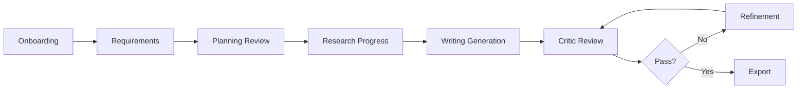

# PRD Generator Frontend Architecture

## Executive Summary

This document outlines the comprehensive frontend architecture for the PRD Generator multi-agent system. Built with Bun, Vite, TypeScript, and React 19, the frontend provides a sophisticated real-time interface for creating Product Requirements Documents through an AI-powered multi-agent workflow.

## Table of Contents
1. [Technology Stack](#technology-stack)
2. [Project Structure](#project-structure)
3. [Component Architecture](#component-architecture)
4. [State Management](#state-management)
5. [Real-time Communication](#real-time-communication)
6. [UI/UX Workflow](#uiux-workflow)
7. [Type System](#type-system)
8. [Implementation Examples](#implementation-examples)
9. [Performance Optimization](#performance-optimization)
10. [Testing Strategy](#testing-strategy)
11. [Deployment](#deployment)

## Technology Stack

### Core Technologies (Updated August 2025)

```json
{
  "runtime": "bun@1.2.21",
  "bundler": "vite@7.1.3",
  "framework": "react@19.1.1",
  "language": "typescript@5.9.0",
  "styling": "tailwindcss@4.0.0",
  "ui-components": "shadcn-ui@3.0.0"
}
```

### Important Version Notes

- **Bun 1.2**: Includes built-in Postgres client, S3 support, and new text-based lockfile format
- **Vite 7**: Requires Node.js 20.19+ or 22.12+ (Node 18 support dropped)
- **React 19.1**: Improved React Server Components and debugging capabilities
- **TypeScript 5.9**: Better tsconfig.json defaults with "module": "nodenext"
- **TailwindCSS 4**: Major update with CSS variables migration required
- **shadcn/ui 3.0**: CLI improvements with namespaced registries and MCP Server support

### Package Configuration (package.json)

```json
{
  "name": "prd-generator-frontend",
  "version": "1.0.0",
  "type": "module",
  "scripts": {
    "dev": "bunx vite",
    "build": "bun run type-check && bunx vite build",
    "preview": "bunx vite preview",
    "type-check": "tsc --noEmit",
    "lint": "eslint src --ext .ts,.tsx",
    "test": "bun test",
    "test:e2e": "playwright test"
  },
  "dependencies": {
    "react": "^19.1.1",
    "react-dom": "^19.1.1",
    "@tanstack/react-query": "^5.85.5",
    "zustand": "^5.0.8",
    "radix-ui": "^1.0.0",
    "react-hook-form": "^7.53.0",
    "zod": "^3.23.8",
    "@hookform/resolvers": "^3.9.0",
    "lexical": "^0.34.0",
    "@lexical/react": "^0.34.0",
    "recharts": "^2.12.7",
    "react-markdown": "^9.0.1",
    "remark-gfm": "^4.0.0",
    "clsx": "^2.1.1",
    "tailwind-merge": "^2.5.0",
    "tw-animate-css": "^1.2.9",
    "date-fns": "^3.6.0",
    "uuid": "^10.0.0",
    "diff": "^5.2.0",
    "jspdf": "^2.5.2",
    "docx": "^8.5.0"
  },
  "devDependencies": {
    "@types/react": "^19.0.0",
    "@types/react-dom": "^19.0.0",
    "@types/node": "^22.5.0",
    "@vitejs/plugin-react-swc": "^3.7.0",
    "typescript": "^5.9.0",
    "vite": "^7.1.3",
    "tailwindcss": "^4.0.0",
    "autoprefixer": "^10.4.20",
    "postcss": "^8.4.45",
    "@typescript-eslint/eslint-plugin": "^8.0.0",
    "@typescript-eslint/parser": "^8.0.0",
    "eslint": "^9.9.0",
    "eslint-plugin-react-hooks": "^5.0.0",
    "@playwright/test": "^1.46.0",
    "@testing-library/react": "^16.0.0",
    "@testing-library/jest-dom": "^6.4.8",
    "vitest": "^2.0.5"
  }
}
```

### Vite Configuration (Updated for v7)

```typescript
// vite.config.ts
import { defineConfig } from 'vite';
import react from '@vitejs/plugin-react-swc';
import path from 'path';

export default defineConfig({
  plugins: [react()],
  resolve: {
    alias: {
      '@': path.resolve(__dirname, './src'),
      '@components': path.resolve(__dirname, './src/components'),
      '@features': path.resolve(__dirname, './src/features'),
      '@hooks': path.resolve(__dirname, './src/hooks'),
      '@services': path.resolve(__dirname, './src/services'),
      '@stores': path.resolve(__dirname, './src/stores'),
      '@types': path.resolve(__dirname, './src/types'),
      '@utils': path.resolve(__dirname, './src/utils'),
    },
  },
  server: {
    port: 5173,
    proxy: {
      '/api': {
        target: 'http://localhost:8000',
        changeOrigin: true,
      },
    },
  },
  build: {
    // Vite 7 uses 'baseline-widely-available' as default
    target: 'esnext',
    minify: 'terser', // Updated from 'esbuild' for better optimization
    sourcemap: true,
    rollupOptions: {
      output: {
        manualChunks: {
          'react-vendor': ['react', 'react-dom'],
          'ui-vendor': ['radix-ui'], // Updated for unified radix-ui package
          'editor-vendor': ['lexical', '@lexical/react'],
          'query-vendor': ['@tanstack/react-query'],
          'state-vendor': ['zustand'],
        },
      },
    },
  },
  // Vite 7 specific optimizations
  optimizeDeps: {
    include: ['react', 'react-dom', 'radix-ui'],
  },
});
```

## Project Structure

```
frontend/
├── src/
│   ├── app/
│   │   ├── App.tsx                 # Main application component
│   │   ├── providers.tsx           # Context providers wrapper
│   │   └── router.tsx              # Route configuration
│   │
│   ├── features/                   # Feature-based modules
│   │   ├── onboarding/
│   │   │   ├── components/
│   │   │   │   ├── WelcomeScreen.tsx
│   │   │   │   ├── TemplateSelector.tsx
│   │   │   │   └── ExamplePRDs.tsx
│   │   │   ├── hooks/
│   │   │   └── types/
│   │   │
│   │   ├── requirements/
│   │   │   ├── components/
│   │   │   │   ├── RequirementsWizard.tsx
│   │   │   │   ├── ProductVisionForm.tsx
│   │   │   │   ├── TargetMarketForm.tsx
│   │   │   │   ├── ConstraintsForm.tsx
│   │   │   │   └── RequirementsSummary.tsx
│   │   │   ├── hooks/
│   │   │   │   └── useRequirementsForm.ts
│   │   │   └── schemas/
│   │   │       └── requirements.schema.ts
│   │   │
│   │   ├── planning/
│   │   │   ├── components/
│   │   │   │   ├── PlanningReview.tsx
│   │   │   │   ├── OutlineEditor.tsx
│   │   │   │   ├── SectionManager.tsx
│   │   │   │   └── ResearchQueries.tsx
│   │   │   └── hooks/
│   │   │
│   │   ├── research/
│   │   │   ├── components/
│   │   │   │   ├── ResearchDashboard.tsx
│   │   │   │   ├── AgentProgress.tsx
│   │   │   │   ├── SourceTracker.tsx
│   │   │   │   └── ResearchTimeline.tsx
│   │   │   ├── hooks/
│   │   │   │   └── useResearchProgress.ts
│   │   │   └── types/
│   │   │
│   │   ├── writing/
│   │   │   ├── components/
│   │   │   │   ├── PRDWriter.tsx
│   │   │   │   ├── LiveGeneration.tsx
│   │   │   │   └── SectionProgress.tsx
│   │   │   └── hooks/
│   │   │
│   │   ├── critics/
│   │   │   ├── components/
│   │   │   │   ├── CriticDashboard.tsx
│   │   │   │   ├── CriticCard.tsx
│   │   │   │   ├── FeedbackVisualizer.tsx
│   │   │   │   ├── ScoreChart.tsx
│   │   │   │   └── ConsensusFeedback.tsx
│   │   │   ├── hooks/
│   │   │   │   └── useCriticFeedback.ts
│   │   │   └── utils/
│   │   │       └── feedbackAggregator.ts
│   │   │
│   │   ├── refinement/
│   │   │   ├── components/
│   │   │   │   ├── RefinementInterface.tsx
│   │   │   │   ├── VersionComparison.tsx
│   │   │   │   ├── FeedbackResolver.tsx
│   │   │   │   ├── ChangeTracker.tsx
│   │   │   │   └── IterationHistory.tsx
│   │   │   └── hooks/
│   │   │
│   │   └── export/
│   │       ├── components/
│   │       │   ├── ExportManager.tsx
│   │       │   ├── FormatSelector.tsx
│   │       │   └── DeliveryOptions.tsx
│   │       └── utils/
│   │           ├── pdfExporter.ts
│   │           ├── docxExporter.ts
│   │           └── markdownExporter.ts
│   │
│   ├── components/                 # Shared components
│   │   ├── ui/                    # shadcn/ui components
│   │   │   ├── button.tsx
│   │   │   ├── card.tsx
│   │   │   ├── dialog.tsx
│   │   │   ├── tabs.tsx
│   │   │   ├── progress.tsx
│   │   │   ├── badge.tsx
│   │   │   └── ...
│   │   ├── layout/
│   │   │   ├── Header.tsx
│   │   │   ├── Sidebar.tsx
│   │   │   ├── MainLayout.tsx
│   │   │   └── PhaseIndicator.tsx
│   │   ├── editor/
│   │   │   ├── RichTextEditor.tsx
│   │   │   ├── MarkdownEditor.tsx
│   │   │   └── InlineComments.tsx
│   │   └── common/
│   │       ├── ActivityTimeline.tsx
│   │       ├── AgentStatus.tsx
│   │       ├── LoadingStates.tsx
│   │       └── ErrorBoundary.tsx
│   │
│   ├── hooks/                      # Custom React hooks
│   │   ├── useSSE.ts
│   │   ├── useWebSocket.ts
│   │   ├── useAgent.ts
│   │   ├── usePRDState.ts
│   │   ├── useVersionControl.ts
│   │   ├── useAutoSave.ts
│   │   └── useKeyboardShortcuts.ts
│   │
│   ├── services/                   # API and external services
│   │   ├── api/
│   │   │   ├── client.ts
│   │   │   ├── endpoints.ts
│   │   │   └── interceptors.ts
│   │   ├── sse/
│   │   │   ├── sseClient.ts
│   │   │   ├── eventParser.ts
│   │   │   └── eventHandlers.ts
│   │   ├── websocket/
│   │   │   ├── wsClient.ts
│   │   │   └── wsHandlers.ts
│   │   └── storage/
│   │       ├── localStorage.ts
│   │       └── sessionStorage.ts
│   │
│   ├── stores/                     # Zustand stores
│   │   ├── sessionStore.ts
│   │   ├── workflowStore.ts
│   │   ├── agentStore.ts
│   │   ├── documentStore.ts
│   │   ├── uiStore.ts
│   │   └── index.ts
│   │
│   ├── types/                      # TypeScript definitions
│   │   ├── api.types.ts
│   │   ├── agent.types.ts
│   │   ├── prd.types.ts
│   │   ├── workflow.types.ts
│   │   ├── events.types.ts
│   │   └── index.ts
│   │
│   ├── utils/                      # Utility functions
│   │   ├── formatting.ts
│   │   ├── validation.ts
│   │   ├── diff.ts
│   │   ├── debounce.ts
│   │   └── constants.ts
│   │
│   ├── styles/
│   │   ├── globals.css
│   │   └── tailwind.css
│   │
│   └── main.tsx                    # Application entry point
│
├── public/
│   ├── templates/                  # PRD templates
│   └── examples/                   # Example PRDs
│
├── tests/
│   ├── unit/
│   ├── integration/
│   └── e2e/
│
├── .env.example
├── .eslintrc.json
├── .gitignore
├── bun.lockb
├── package.json
├── postcss.config.js
├── tailwind.config.ts
├── tsconfig.json
├── tsconfig.node.json
└── vite.config.ts
```

## Component Architecture

### Core Components Hierarchy

```typescript
// App.tsx - Main Application Component
import React from 'react';
import { QueryClient, QueryClientProvider } from '@tanstack/react-query';
import { ReactQueryDevtools } from '@tanstack/react-query-devtools';
import { Providers } from './providers';
import { PRDOrchestrator } from '@features/orchestrator';

const queryClient = new QueryClient({
  defaultOptions: {
    queries: {
      staleTime: 5 * 60 * 1000, // 5 minutes
      retry: 3,
      retryDelay: attemptIndex => Math.min(1000 * 2 ** attemptIndex, 30000),
    },
  },
});

export default function App() {
  return (
    <QueryClientProvider client={queryClient}>
      <Providers>
        <PRDOrchestrator />
      </Providers>
      <ReactQueryDevtools initialIsOpen={false} />
    </QueryClientProvider>
  );
}
```

### PRD Orchestrator Component

```typescript
// features/orchestrator/PRDOrchestrator.tsx
import React, { useState, useEffect } from 'react';
import { useWorkflowStore } from '@stores/workflowStore';
import { useAgentStore } from '@stores/agentStore';
import { WorkflowPhase } from '@types';
import { OnboardingPhase } from '@features/onboarding';
import { RequirementsPhase } from '@features/requirements';
import { PlanningPhase } from '@features/planning';
import { ResearchPhase } from '@features/research';
import { WritingPhase } from '@features/writing';
import { CriticsPhase } from '@features/critics';
import { RefinementPhase } from '@features/refinement';
import { ExportPhase } from '@features/export';
import { PhaseTransition } from './PhaseTransition';

export function PRDOrchestrator() {
  const { currentPhase, transitionToPhase } = useWorkflowStore();
  const { activeAgents } = useAgentStore();
  
  const renderPhase = () => {
    switch (currentPhase) {
      case WorkflowPhase.ONBOARDING:
        return <OnboardingPhase onComplete={() => transitionToPhase(WorkflowPhase.REQUIREMENTS)} />;
      case WorkflowPhase.REQUIREMENTS:
        return <RequirementsPhase onComplete={() => transitionToPhase(WorkflowPhase.PLANNING)} />;
      case WorkflowPhase.PLANNING:
        return <PlanningPhase onComplete={() => transitionToPhase(WorkflowPhase.RESEARCH)} />;
      case WorkflowPhase.RESEARCH:
        return <ResearchPhase onComplete={() => transitionToPhase(WorkflowPhase.WRITING)} />;
      case WorkflowPhase.WRITING:
        return <WritingPhase onComplete={() => transitionToPhase(WorkflowPhase.CRITICS)} />;
      case WorkflowPhase.CRITICS:
        return <CriticsPhase onComplete={() => transitionToPhase(WorkflowPhase.REFINEMENT)} />;
      case WorkflowPhase.REFINEMENT:
        return <RefinementPhase onComplete={() => transitionToPhase(WorkflowPhase.EXPORT)} />;
      case WorkflowPhase.EXPORT:
        return <ExportPhase />;
      default:
        return <OnboardingPhase onComplete={() => transitionToPhase(WorkflowPhase.REQUIREMENTS)} />;
    }
  };
  
  return (
    <div className="min-h-screen bg-gradient-to-br from-gray-50 to-gray-100 dark:from-gray-900 dark:to-gray-800">
      <Header currentPhase={currentPhase} />
      <PhaseIndicator 
        currentPhase={currentPhase} 
        activeAgents={activeAgents}
      />
      <main className="container mx-auto px-4 py-8">
        <PhaseTransition phase={currentPhase}>
          {renderPhase()}
        </PhaseTransition>
      </main>
      <AgentActivityPanel />
    </div>
  );
}
```

### Requirements Wizard Component

```typescript
// features/requirements/components/RequirementsWizard.tsx
import React, { useState } from 'react';
import { useForm } from 'react-hook-form';
import { zodResolver } from '@hookform/resolvers/zod';
import { z } from 'zod';
import { Button } from '@components/ui/button';
import { Progress } from '@components/ui/progress';
import { ProductVisionForm } from './ProductVisionForm';
import { TargetMarketForm } from './TargetMarketForm';
import { ConstraintsForm } from './ConstraintsForm';
import { RequirementsSummary } from './RequirementsSummary';

const requirementsSchema = z.object({
  productVision: z.object({
    name: z.string().min(3, 'Product name must be at least 3 characters'),
    description: z.string().min(50, 'Please provide a detailed description'),
    problemStatement: z.string().min(30, 'Describe the problem being solved'),
    valueProposition: z.string().min(30, 'What unique value does this provide?'),
  }),
  targetMarket: z.object({
    primaryAudience: z.string().min(10),
    marketSize: z.enum(['small', 'medium', 'large', 'enterprise']),
    geographicScope: z.array(z.string()).min(1),
    industryVerticals: z.array(z.string()).min(1),
  }),
  constraints: z.object({
    timeline: z.string(),
    budget: z.string().optional(),
    technicalConstraints: z.array(z.string()),
    regulatoryRequirements: z.array(z.string()),
  }),
});

type RequirementsData = z.infer<typeof requirementsSchema>;

interface Props {
  onComplete: (data: RequirementsData) => void;
}

export function RequirementsWizard({ onComplete }: Props) {
  const [step, setStep] = useState(1);
  const totalSteps = 4;
  
  const form = useForm<RequirementsData>({
    resolver: zodResolver(requirementsSchema),
    mode: 'onChange',
  });
  
  const progress = (step / totalSteps) * 100;
  
  const handleNext = async () => {
    const fields = getFieldsForStep(step);
    const isValid = await form.trigger(fields);
    
    if (isValid) {
      if (step < totalSteps) {
        setStep(step + 1);
      } else {
        form.handleSubmit(onComplete)();
      }
    }
  };
  
  const handleBack = () => {
    if (step > 1) setStep(step - 1);
  };
  
  const getFieldsForStep = (step: number): (keyof RequirementsData)[] => {
    switch (step) {
      case 1: return ['productVision'];
      case 2: return ['targetMarket'];
      case 3: return ['constraints'];
      default: return [];
    }
  };
  
  const renderStep = () => {
    switch (step) {
      case 1:
        return <ProductVisionForm form={form} />;
      case 2:
        return <TargetMarketForm form={form} />;
      case 3:
        return <ConstraintsForm form={form} />;
      case 4:
        return <RequirementsSummary data={form.getValues()} />;
      default:
        return null;
    }
  };
  
  return (
    <div className="max-w-4xl mx-auto">
      <div className="mb-8">
        <h2 className="text-3xl font-bold mb-2">Product Requirements</h2>
        <p className="text-gray-600">Step {step} of {totalSteps}</p>
        <Progress value={progress} className="mt-4" />
      </div>
      
      <div className="bg-white dark:bg-gray-800 rounded-lg shadow-lg p-8">
        {renderStep()}
      </div>
      
      <div className="flex justify-between mt-6">
        <Button
          variant="outline"
          onClick={handleBack}
          disabled={step === 1}
        >
          Back
        </Button>
        <Button
          onClick={handleNext}
          className="min-w-[120px]"
        >
          {step === totalSteps ? 'Submit' : 'Next'}
        </Button>
      </div>
    </div>
  );
}
```

### Critic Dashboard Component

```typescript
// features/critics/components/CriticDashboard.tsx
import React, { useEffect, useState } from 'react';
import { useSSE } from '@hooks/useSSE';
import { CriticCard } from './CriticCard';
import { FeedbackVisualizer } from './FeedbackVisualizer';
import { ConsensusFeedback } from './ConsensusFeedback';
import { ScoreChart } from './ScoreChart';
import { CriticFeedback, CriticRole } from '@types';

export function CriticDashboard() {
  const [directorFeedback, setDirectorFeedback] = useState<CriticFeedback | null>(null);
  const [designFeedback, setDesignFeedback] = useState<CriticFeedback | null>(null);
  const [engineeringFeedback, setEngineeringFeedback] = useState<CriticFeedback | null>(null);
  const [consensusFeedback, setConsensusFeedback] = useState(null);
  
  const { events } = useSSE('/api/critics/feedback');
  
  useEffect(() => {
    events.forEach(event => {
      if (event.type === 'critic_feedback') {
        switch (event.data.role) {
          case CriticRole.DIRECTOR:
            setDirectorFeedback(event.data);
            break;
          case CriticRole.DESIGN:
            setDesignFeedback(event.data);
            break;
          case CriticRole.ENGINEERING:
            setEngineeringFeedback(event.data);
            break;
        }
      } else if (event.type === 'consensus_feedback') {
        setConsensusFeedback(event.data);
      }
    });
  }, [events]);
  
  const allFeedback = [directorFeedback, designFeedback, engineeringFeedback].filter(Boolean);
  const averageScore = allFeedback.reduce((acc, f) => acc + (f?.score || 0), 0) / allFeedback.length;
  
  return (
    <div className="space-y-6">
      {/* Score Overview */}
      <div className="bg-white dark:bg-gray-800 rounded-lg p-6">
        <h3 className="text-xl font-semibold mb-4">Overall Assessment</h3>
        <div className="grid grid-cols-1 md:grid-cols-2 gap-6">
          <ScoreChart 
            scores={{
              director: directorFeedback?.score,
              design: designFeedback?.score,
              engineering: engineeringFeedback?.score,
            }}
            average={averageScore}
          />
          <div className="space-y-4">
            <div className="flex items-center justify-between">
              <span className="text-gray-600">Average Score</span>
              <span className="text-3xl font-bold">{averageScore.toFixed(1)}/100</span>
            </div>
            <div className="flex items-center justify-between">
              <span className="text-gray-600">Consensus Grade</span>
              <span className={`text-xl font-semibold ${
                consensusFeedback?.grade === 'pass' ? 'text-green-600' : 'text-yellow-600'
              }`}>
                {consensusFeedback?.grade || 'Pending'}
              </span>
            </div>
          </div>
        </div>
      </div>
      
      {/* Individual Critic Feedback */}
      <div className="grid grid-cols-1 lg:grid-cols-3 gap-6">
        <CriticCard
          title="Director of Product"
          role={CriticRole.DIRECTOR}
          feedback={directorFeedback}
          icon="🎯"
          accentColor="blue"
        />
        <CriticCard
          title="Head of Design"
          role={CriticRole.DESIGN}
          feedback={designFeedback}
          icon="🎨"
          accentColor="purple"
        />
        <CriticCard
          title="Head of Engineering"
          role={CriticRole.ENGINEERING}
          feedback={engineeringFeedback}
          icon="⚙️"
          accentColor="green"
        />
      </div>
      
      {/* Consensus and Visualization */}
      {consensusFeedback && (
        <div className="grid grid-cols-1 lg:grid-cols-2 gap-6">
          <ConsensusFeedback feedback={consensusFeedback} />
          <FeedbackVisualizer 
            directorFeedback={directorFeedback}
            designFeedback={designFeedback}
            engineeringFeedback={engineeringFeedback}
          />
        </div>
      )}
    </div>
  );
}
```

## State Management

### Zustand Store Architecture

```typescript
// stores/workflowStore.ts
import { create } from 'zustand';
import { devtools, persist } from 'zustand/middleware';
import { WorkflowPhase, PRDRequirements } from '@types';

interface WorkflowState {
  // State
  sessionId: string | null;
  currentPhase: WorkflowPhase;
  phaseHistory: WorkflowPhase[];
  requirements: PRDRequirements | null;
  prdOutline: any | null;
  isLocked: boolean;
  
  // Actions
  initSession: (sessionId: string) => void;
  transitionToPhase: (phase: WorkflowPhase) => void;
  saveRequirements: (requirements: PRDRequirements) => void;
  savePRDOutline: (outline: any) => void;
  lockWorkflow: () => void;
  unlockWorkflow: () => void;
  reset: () => void;
}

export const useWorkflowStore = create<WorkflowState>()(
  devtools(
    persist(
      (set, get) => ({
        // Initial state
        sessionId: null,
        currentPhase: WorkflowPhase.ONBOARDING,
        phaseHistory: [WorkflowPhase.ONBOARDING],
        requirements: null,
        prdOutline: null,
        isLocked: false,
        
        // Actions
        initSession: (sessionId) => 
          set({ sessionId }, false, 'initSession'),
        
        transitionToPhase: (phase) => 
          set((state) => ({
            currentPhase: phase,
            phaseHistory: [...state.phaseHistory, phase],
          }), false, 'transitionToPhase'),
        
        saveRequirements: (requirements) =>
          set({ requirements }, false, 'saveRequirements'),
        
        savePRDOutline: (outline) =>
          set({ prdOutline: outline }, false, 'savePRDOutline'),
        
        lockWorkflow: () =>
          set({ isLocked: true }, false, 'lockWorkflow'),
        
        unlockWorkflow: () =>
          set({ isLocked: false }, false, 'unlockWorkflow'),
        
        reset: () =>
          set({
            sessionId: null,
            currentPhase: WorkflowPhase.ONBOARDING,
            phaseHistory: [WorkflowPhase.ONBOARDING],
            requirements: null,
            prdOutline: null,
            isLocked: false,
          }, false, 'reset'),
      }),
      {
        name: 'prd-workflow-storage',
        partialize: (state) => ({
          sessionId: state.sessionId,
          requirements: state.requirements,
        }),
      }
    ),
    {
      name: 'WorkflowStore',
    }
  )
);
```

### Agent Store

```typescript
// stores/agentStore.ts
import { create } from 'zustand';
import { subscribeWithSelector } from 'zustand/middleware';
import { AgentStatus, AgentEvent } from '@types';

interface AgentState {
  // State
  activeAgents: Map<string, AgentStatus>;
  agentEvents: AgentEvent[];
  agentOutputs: Map<string, any>;
  
  // Actions
  updateAgentStatus: (agentId: string, status: AgentStatus) => void;
  addAgentEvent: (event: AgentEvent) => void;
  setAgentOutput: (agentId: string, output: any) => void;
  clearAgentEvents: () => void;
}

export const useAgentStore = create<AgentState>()(
  subscribeWithSelector((set) => ({
    // Initial state
    activeAgents: new Map(),
    agentEvents: [],
    agentOutputs: new Map(),
    
    // Actions
    updateAgentStatus: (agentId, status) =>
      set((state) => {
        const agents = new Map(state.activeAgents);
        agents.set(agentId, status);
        return { activeAgents: agents };
      }),
    
    addAgentEvent: (event) =>
      set((state) => ({
        agentEvents: [...state.agentEvents, event],
      })),
    
    setAgentOutput: (agentId, output) =>
      set((state) => {
        const outputs = new Map(state.agentOutputs);
        outputs.set(agentId, output);
        return { agentOutputs: outputs };
      }),
    
    clearAgentEvents: () =>
      set({ agentEvents: [] }),
  }))
);

// Subscribe to specific agent status changes
useAgentStore.subscribe(
  (state) => state.activeAgents,
  (activeAgents) => {
    console.log('Active agents updated:', Array.from(activeAgents.entries()));
  }
);
```

### Document Store

```typescript
// stores/documentStore.ts
import { create } from 'zustand';
import { PRDDocument, PRDVersion, PRDSection } from '@types';

interface DocumentState {
  // State
  currentDocument: PRDDocument | null;
  versions: PRDVersion[];
  currentVersion: number;
  isDirty: boolean;
  editingSections: Set<string>;
  comments: Map<string, Comment[]>;
  
  // Actions
  loadDocument: (document: PRDDocument) => void;
  updateSection: (sectionId: string, content: string) => void;
  createVersion: (description: string) => void;
  switchVersion: (versionNumber: number) => void;
  addComment: (sectionId: string, comment: Comment) => void;
  markSectionEditing: (sectionId: string, isEditing: boolean) => void;
  saveDocument: () => Promise<void>;
}

export const useDocumentStore = create<DocumentState>((set, get) => ({
  // Initial state
  currentDocument: null,
  versions: [],
  currentVersion: 1,
  isDirty: false,
  editingSections: new Set(),
  comments: new Map(),
  
  // Actions
  loadDocument: (document) =>
    set({
      currentDocument: document,
      versions: document.versions || [],
      currentVersion: document.currentVersion || 1,
      isDirty: false,
    }),
  
  updateSection: (sectionId, content) =>
    set((state) => {
      if (!state.currentDocument) return state;
      
      const updatedDocument = {
        ...state.currentDocument,
        sections: state.currentDocument.sections.map(section =>
          section.id === sectionId
            ? { ...section, content }
            : section
        ),
      };
      
      return {
        currentDocument: updatedDocument,
        isDirty: true,
      };
    }),
  
  createVersion: (description) =>
    set((state) => {
      const newVersion: PRDVersion = {
        number: state.currentVersion + 1,
        description,
        timestamp: new Date().toISOString(),
        document: JSON.parse(JSON.stringify(state.currentDocument)),
      };
      
      return {
        versions: [...state.versions, newVersion],
        currentVersion: newVersion.number,
        isDirty: false,
      };
    }),
  
  switchVersion: (versionNumber) =>
    set((state) => {
      const version = state.versions.find(v => v.number === versionNumber);
      if (!version) return state;
      
      return {
        currentDocument: version.document,
        currentVersion: versionNumber,
        isDirty: false,
      };
    }),
  
  addComment: (sectionId, comment) =>
    set((state) => {
      const comments = new Map(state.comments);
      const sectionComments = comments.get(sectionId) || [];
      comments.set(sectionId, [...sectionComments, comment]);
      return { comments };
    }),
  
  markSectionEditing: (sectionId, isEditing) =>
    set((state) => {
      const editingSections = new Set(state.editingSections);
      if (isEditing) {
        editingSections.add(sectionId);
      } else {
        editingSections.delete(sectionId);
      }
      return { editingSections };
    }),
  
  saveDocument: async () => {
    const state = get();
    if (!state.isDirty || !state.currentDocument) return;
    
    // API call to save document
    await fetch('/api/documents/save', {
      method: 'POST',
      headers: { 'Content-Type': 'application/json' },
      body: JSON.stringify(state.currentDocument),
    });
    
    set({ isDirty: false });
  },
}));
```

## Real-time Communication

### SSE Client Implementation

```typescript
// services/sse/sseClient.ts
export class SSEClient {
  private eventSource: EventSource | null = null;
  private reconnectAttempts = 0;
  private maxReconnectAttempts = 5;
  private reconnectDelay = 1000;
  private listeners: Map<string, Set<EventListener>> = new Map();
  
  constructor(private url: string) {}
  
  connect(): void {
    if (this.eventSource) {
      this.disconnect();
    }
    
    this.eventSource = new EventSource(this.url);
    
    this.eventSource.onopen = () => {
      console.log('SSE connection established');
      this.reconnectAttempts = 0;
    };
    
    this.eventSource.onerror = (error) => {
      console.error('SSE error:', error);
      this.handleReconnect();
    };
    
    this.eventSource.onmessage = (event) => {
      this.handleMessage(event);
    };
    
    // Register for specific event types
    this.registerEventTypes();
  }
  
  private registerEventTypes(): void {
    const eventTypes = [
      'agent_status',
      'agent_output',
      'research_progress',
      'critic_feedback',
      'refinement_update',
      'document_change',
    ];
    
    eventTypes.forEach(type => {
      this.eventSource?.addEventListener(type, (event) => {
        this.notifyListeners(type, JSON.parse(event.data));
      });
    });
  }
  
  private handleMessage(event: MessageEvent): void {
    try {
      const data = JSON.parse(event.data);
      this.notifyListeners('message', data);
    } catch (error) {
      console.error('Failed to parse SSE message:', error);
    }
  }
  
  private handleReconnect(): void {
    if (this.reconnectAttempts >= this.maxReconnectAttempts) {
      console.error('Max reconnection attempts reached');
      this.notifyListeners('connection_failed', null);
      return;
    }
    
    this.reconnectAttempts++;
    const delay = this.reconnectDelay * Math.pow(2, this.reconnectAttempts - 1);
    
    setTimeout(() => {
      console.log(`Attempting reconnection ${this.reconnectAttempts}/${this.maxReconnectAttempts}`);
      this.connect();
    }, delay);
  }
  
  addEventListener(type: string, listener: EventListener): void {
    if (!this.listeners.has(type)) {
      this.listeners.set(type, new Set());
    }
    this.listeners.get(type)?.add(listener);
  }
  
  removeEventListener(type: string, listener: EventListener): void {
    this.listeners.get(type)?.delete(listener);
  }
  
  private notifyListeners(type: string, data: any): void {
    this.listeners.get(type)?.forEach(listener => {
      listener({ type, data } as any);
    });
  }
  
  disconnect(): void {
    this.eventSource?.close();
    this.eventSource = null;
  }
}
```

### SSE Hook

```typescript
// hooks/useSSE.ts
import { useEffect, useState, useRef, useCallback } from 'react';
import { SSEClient } from '@services/sse/sseClient';
import { useSessionStore } from '@stores/sessionStore';

interface SSEOptions {
  autoConnect?: boolean;
  reconnect?: boolean;
  onMessage?: (data: any) => void;
  onError?: (error: any) => void;
}

export function useSSE(endpoint: string, options: SSEOptions = {}) {
  const { autoConnect = true, reconnect = true, onMessage, onError } = options;
  const [isConnected, setIsConnected] = useState(false);
  const [events, setEvents] = useState<any[]>([]);
  const clientRef = useRef<SSEClient | null>(null);
  const { sessionId } = useSessionStore();
  
  const connect = useCallback(() => {
    if (!sessionId) return;
    
    const url = `${endpoint}?sessionId=${sessionId}`;
    clientRef.current = new SSEClient(url);
    
    clientRef.current.addEventListener('message', (event: any) => {
      setEvents(prev => [...prev, event.data]);
      onMessage?.(event.data);
    });
    
    clientRef.current.addEventListener('connection_failed', () => {
      setIsConnected(false);
      onError?.({ type: 'connection_failed' });
    });
    
    clientRef.current.connect();
    setIsConnected(true);
  }, [endpoint, sessionId, onMessage, onError]);
  
  const disconnect = useCallback(() => {
    clientRef.current?.disconnect();
    setIsConnected(false);
  }, []);
  
  useEffect(() => {
    if (autoConnect) {
      connect();
    }
    
    return () => {
      disconnect();
    };
  }, [autoConnect, connect, disconnect]);
  
  return {
    isConnected,
    events,
    connect,
    disconnect,
    clearEvents: () => setEvents([]),
  };
}
```

### WebSocket Integration

```typescript
// services/websocket/wsClient.ts
export class WSClient {
  private ws: WebSocket | null = null;
  private messageQueue: any[] = [];
  private handlers: Map<string, (data: any) => void> = new Map();
  
  constructor(private url: string) {}
  
  async connect(): Promise<void> {
    return new Promise((resolve, reject) => {
      this.ws = new WebSocket(this.url);
      
      this.ws.onopen = () => {
        console.log('WebSocket connected');
        this.flushMessageQueue();
        resolve();
      };
      
      this.ws.onerror = (error) => {
        console.error('WebSocket error:', error);
        reject(error);
      };
      
      this.ws.onmessage = (event) => {
        this.handleMessage(event.data);
      };
      
      this.ws.onclose = () => {
        console.log('WebSocket disconnected');
        this.handleReconnect();
      };
    });
  }
  
  private handleMessage(data: string): void {
    try {
      const message = JSON.parse(data);
      const handler = this.handlers.get(message.type);
      if (handler) {
        handler(message.data);
      }
    } catch (error) {
      console.error('Failed to parse WebSocket message:', error);
    }
  }
  
  send(type: string, data: any): void {
    const message = JSON.stringify({ type, data });
    
    if (this.ws?.readyState === WebSocket.OPEN) {
      this.ws.send(message);
    } else {
      this.messageQueue.push(message);
    }
  }
  
  private flushMessageQueue(): void {
    while (this.messageQueue.length > 0) {
      const message = this.messageQueue.shift();
      this.ws?.send(message);
    }
  }
  
  on(type: string, handler: (data: any) => void): void {
    this.handlers.set(type, handler);
  }
  
  off(type: string): void {
    this.handlers.delete(type);
  }
  
  private handleReconnect(): void {
    setTimeout(() => {
      this.connect();
    }, 3000);
  }
  
  disconnect(): void {
    this.ws?.close();
    this.ws = null;
  }
}
```

## UI/UX Workflow

### Phase Navigation Flow



### Research Progress Dashboard

```typescript
// features/research/components/ResearchDashboard.tsx
import React from 'react';
import { useAgentStore } from '@stores/agentStore';
import { AgentProgress } from './AgentProgress';
import { SourceTracker } from './SourceTracker';
import { ResearchTimeline } from './ResearchTimeline';
import { Card } from '@components/ui/card';
import { Progress } from '@components/ui/progress';
import { Badge } from '@components/ui/badge';

export function ResearchDashboard() {
  const { activeAgents } = useAgentStore();
  
  const researchers = [
    { id: 'market_researcher', name: 'Market Researcher', icon: '📊' },
    { id: 'competitor_analyst', name: 'Competitor Analyst', icon: '🔍' },
    { id: 'user_researcher', name: 'User Researcher', icon: '👥' },
  ];
  
  return (
    <div className="space-y-6">
      {/* Overall Progress */}
      <Card className="p-6">
        <div className="flex items-center justify-between mb-4">
          <h3 className="text-lg font-semibold">Research Progress</h3>
          <Badge variant="outline">Phase 3 of 8</Badge>
        </div>
        <Progress value={45} className="mb-2" />
        <p className="text-sm text-gray-600">
          Gathering market intelligence and user insights...
        </p>
      </Card>
      
      {/* Parallel Agent Progress */}
      <div className="grid grid-cols-1 md:grid-cols-3 gap-4">
        {researchers.map(researcher => (
          <AgentProgress
            key={researcher.id}
            agentId={researcher.id}
            name={researcher.name}
            icon={researcher.icon}
            status={activeAgents.get(researcher.id)}
          />
        ))}
      </div>
      
      {/* Sources and Timeline */}
      <div className="grid grid-cols-1 lg:grid-cols-2 gap-6">
        <SourceTracker />
        <ResearchTimeline />
      </div>
    </div>
  );
}
```

### Version Comparison Interface

```typescript
// features/refinement/components/VersionComparison.tsx
import React, { useMemo } from 'react';
import { diffLines, Change } from 'diff';
import { Card } from '@components/ui/card';
import { Badge } from '@components/ui/badge';
import { ScrollArea } from '@components/ui/scroll-area';

interface Props {
  originalVersion: string;
  revisedVersion: string;
  versionNumber: number;
}

export function VersionComparison({ originalVersion, revisedVersion, versionNumber }: Props) {
  const changes = useMemo(() => {
    return diffLines(originalVersion, revisedVersion);
  }, [originalVersion, revisedVersion]);
  
  const stats = useMemo(() => {
    let additions = 0;
    let deletions = 0;
    
    changes.forEach(change => {
      if (change.added) {
        additions += change.count || 0;
      } else if (change.removed) {
        deletions += change.count || 0;
      }
    });
    
    return { additions, deletions };
  }, [changes]);
  
  const renderChange = (change: Change, index: number) => {
    if (change.added) {
      return (
        <div key={index} className="bg-green-50 dark:bg-green-900/20 p-2 border-l-4 border-green-500">
          <pre className="text-green-700 dark:text-green-300 whitespace-pre-wrap">
            {change.value}
          </pre>
        </div>
      );
    }
    
    if (change.removed) {
      return (
        <div key={index} className="bg-red-50 dark:bg-red-900/20 p-2 border-l-4 border-red-500">
          <pre className="text-red-700 dark:text-red-300 whitespace-pre-wrap line-through">
            {change.value}
          </pre>
        </div>
      );
    }
    
    return (
      <div key={index} className="p-2">
        <pre className="text-gray-700 dark:text-gray-300 whitespace-pre-wrap">
          {change.value}
        </pre>
      </div>
    );
  };
  
  return (
    <Card className="p-6">
      <div className="flex items-center justify-between mb-4">
        <h3 className="text-lg font-semibold">Version {versionNumber} Changes</h3>
        <div className="flex gap-2">
          <Badge variant="outline" className="text-green-600">
            +{stats.additions} additions
          </Badge>
          <Badge variant="outline" className="text-red-600">
            -{stats.deletions} deletions
          </Badge>
        </div>
      </div>
      
      <ScrollArea className="h-[600px] border rounded-lg">
        <div className="p-4">
          {changes.map((change, index) => renderChange(change, index))}
        </div>
      </ScrollArea>
    </Card>
  );
}
```

## Type System

### Core Type Definitions

```typescript
// types/workflow.types.ts
export enum WorkflowPhase {
  ONBOARDING = 'onboarding',
  REQUIREMENTS = 'requirements',
  PLANNING = 'planning',
  RESEARCH = 'research',
  WRITING = 'writing',
  CRITICS = 'critics',
  REFINEMENT = 'refinement',
  EXPORT = 'export',
}

export interface PRDRequirements {
  productVision: {
    name: string;
    description: string;
    problemStatement: string;
    valueProposition: string;
  };
  targetMarket: {
    primaryAudience: string;
    marketSize: 'small' | 'medium' | 'large' | 'enterprise';
    geographicScope: string[];
    industryVerticals: string[];
  };
  constraints: {
    timeline: string;
    budget?: string;
    technicalConstraints: string[];
    regulatoryRequirements: string[];
  };
}

// types/agent.types.ts
export interface AgentStatus {
  id: string;
  name: string;
  status: 'idle' | 'running' | 'completed' | 'error';
  progress?: number;
  currentTask?: string;
  startTime?: string;
  endTime?: string;
  output?: any;
}

export interface AgentEvent {
  id: string;
  agentId: string;
  type: 'started' | 'progress' | 'output' | 'completed' | 'error';
  timestamp: string;
  data?: any;
}

// types/prd.types.ts
export interface PRDSection {
  id: string;
  title: string;
  content: string;
  status: 'pending' | 'in-progress' | 'completed' | 'approved';
  version: number;
  lastModified: string;
  author: string;
}

export interface PRDDocument {
  id: string;
  name: string;
  sections: PRDSection[];
  metadata: {
    createdAt: string;
    updatedAt: string;
    version: number;
    status: 'draft' | 'in-review' | 'approved' | 'published';
  };
  versions?: PRDVersion[];
  currentVersion?: number;
}

export interface PRDVersion {
  number: number;
  description: string;
  timestamp: string;
  document: PRDDocument;
  changes?: VersionChange[];
}

export interface VersionChange {
  sectionId: string;
  type: 'addition' | 'deletion' | 'modification';
  before?: string;
  after?: string;
}

// types/critic.types.ts
export enum CriticRole {
  DIRECTOR = 'director_of_product',
  DESIGN = 'head_of_design',
  ENGINEERING = 'head_of_engineering',
}

export interface CriticFeedback {
  role: CriticRole;
  score: number;
  grade: 'pass' | 'needs_revision';
  categoryScores: Record<string, number>;
  issues: string[];
  suggestions: string[];
  commendations: string[];
  priorityChanges: string[];
}

export interface ConsensusFeedback {
  overallGrade: 'pass' | 'needs_revision';
  averageScore: number;
  consensusIssues: string[];
  priorityRevisions: string[];
  unanimousApprovals: string[];
  conflictingFeedback: Array<{
    critic1: string;
    suggestion1: string;
    critic2: string;
    suggestion2: string;
  }>;
}

// types/events.types.ts
export interface SSEEvent {
  type: string;
  data: any;
  id?: string;
  retry?: number;
}

export interface WSMessage {
  type: string;
  data: any;
  timestamp: string;
  sessionId: string;
}
```

## Implementation Examples

### Rich Text Editor Integration

```typescript
// components/editor/RichTextEditor.tsx
import React, { useEffect, useRef } from 'react';
import { $getRoot, $createParagraphNode, EditorState } from 'lexical';
import { LexicalComposer } from '@lexical/react/LexicalComposer';
import { RichTextPlugin } from '@lexical/react/LexicalRichTextPlugin';
import { ContentEditable } from '@lexical/react/LexicalContentEditable';
import { HistoryPlugin } from '@lexical/react/LexicalHistoryPlugin';
import { OnChangePlugin } from '@lexical/react/LexicalOnChangePlugin';
import { AutoFocusPlugin } from '@lexical/react/LexicalAutoFocusPlugin';
import { MarkdownShortcutPlugin } from '@lexical/react/LexicalMarkdownShortcutPlugin';
import { TRANSFORMERS } from '@lexical/markdown';
import LexicalErrorBoundary from '@lexical/react/LexicalErrorBoundary';

interface Props {
  initialContent?: string;
  onChange?: (content: string) => void;
  placeholder?: string;
  readOnly?: boolean;
}

export function RichTextEditor({ 
  initialContent = '', 
  onChange, 
  placeholder = 'Start typing...', 
  readOnly = false 
}: Props) {
  const editorConfig = {
    namespace: 'PRDEditor',
    theme: {
      paragraph: 'mb-2',
      heading: {
        h1: 'text-3xl font-bold mb-4',
        h2: 'text-2xl font-semibold mb-3',
        h3: 'text-xl font-medium mb-2',
      },
      list: {
        ul: 'list-disc ml-6',
        ol: 'list-decimal ml-6',
      },
      text: {
        bold: 'font-bold',
        italic: 'italic',
        underline: 'underline',
        strikethrough: 'line-through',
        code: 'bg-gray-100 px-1 rounded font-mono text-sm',
      },
    },
    onError: (error: Error) => {
      console.error('Lexical Editor Error:', error);
    },
    editorState: initialContent ? 
      EditorState.createFromJSON(JSON.parse(initialContent)) : 
      undefined,
  };
  
  const handleChange = (editorState: EditorState) => {
    editorState.read(() => {
      const root = $getRoot();
      const content = root.getTextContent();
      onChange?.(content);
    });
  };
  
  return (
    <LexicalComposer initialConfig={editorConfig}>
      <div className="relative min-h-[400px] border rounded-lg">
        {!readOnly && <ToolbarPlugin />}
        <div className="p-4">
          <RichTextPlugin
            contentEditable={
              <ContentEditable 
                className="outline-none min-h-[350px]"
                aria-placeholder={placeholder}
                placeholder={
                  <div className="absolute top-4 left-4 text-gray-400 pointer-events-none">
                    {placeholder}
                  </div>
                }
              />
            }
            ErrorBoundary={LexicalErrorBoundary}
          />
          <OnChangePlugin onChange={handleChange} />
          <HistoryPlugin />
          <AutoFocusPlugin />
          <MarkdownShortcutPlugin transformers={TRANSFORMERS} />
        </div>
      </div>
    </LexicalComposer>
  );
}
```

### Activity Timeline Component

```typescript
// components/common/ActivityTimeline.tsx
import React from 'react';
import { format } from 'date-fns';
import { Card } from '@components/ui/card';
import { Badge } from '@components/ui/badge';
import { ScrollArea } from '@components/ui/scroll-area';
import { CheckCircle2, Circle, AlertCircle, Loader2 } from 'lucide-react';
import { AgentEvent } from '@types';

interface Props {
  events: AgentEvent[];
  maxHeight?: string;
}

export function ActivityTimeline({ events, maxHeight = '500px' }: Props) {
  const getEventIcon = (event: AgentEvent) => {
    switch (event.type) {
      case 'completed':
        return <CheckCircle2 className="w-5 h-5 text-green-500" />;
      case 'error':
        return <AlertCircle className="w-5 h-5 text-red-500" />;
      case 'progress':
        return <Loader2 className="w-5 h-5 text-blue-500 animate-spin" />;
      default:
        return <Circle className="w-5 h-5 text-gray-400" />;
    }
  };
  
  const getAgentColor = (agentId: string) => {
    const colors = {
      market_researcher: 'bg-blue-100 text-blue-800',
      competitor_analyst: 'bg-purple-100 text-purple-800',
      user_researcher: 'bg-green-100 text-green-800',
      senior_pm_writer: 'bg-yellow-100 text-yellow-800',
      director_critic: 'bg-red-100 text-red-800',
      design_critic: 'bg-pink-100 text-pink-800',
      engineering_critic: 'bg-indigo-100 text-indigo-800',
    };
    return colors[agentId] || 'bg-gray-100 text-gray-800';
  };
  
  return (
    <Card className="p-6">
      <h3 className="text-lg font-semibold mb-4">Activity Timeline</h3>
      <ScrollArea className={`pr-4`} style={{ maxHeight }}>
        <div className="space-y-4">
          {events.map((event, index) => (
            <div key={event.id} className="flex gap-3">
              <div className="flex flex-col items-center">
                {getEventIcon(event)}
                {index < events.length - 1 && (
                  <div className="w-0.5 h-16 bg-gray-200 mt-1" />
                )}
              </div>
              
              <div className="flex-1 pb-8">
                <div className="flex items-center gap-2 mb-1">
                  <Badge 
                    variant="secondary" 
                    className={getAgentColor(event.agentId)}
                  >
                    {event.agentId.replace(/_/g, ' ')}
                  </Badge>
                  <span className="text-xs text-gray-500">
                    {format(new Date(event.timestamp), 'HH:mm:ss')}
                  </span>
                </div>
                
                <p className="text-sm text-gray-700">
                  {event.data?.message || `${event.type} event`}
                </p>
                
                {event.data?.details && (
                  <div className="mt-2 p-2 bg-gray-50 rounded text-xs">
                    <pre className="whitespace-pre-wrap">
                      {JSON.stringify(event.data.details, null, 2)}
                    </pre>
                  </div>
                )}
              </div>
            </div>
          ))}
        </div>
      </ScrollArea>
    </Card>
  );
}
```

## Performance Optimization

### Code Splitting Strategy

```typescript
// app/router.tsx
import { lazy, Suspense } from 'react';
import { createBrowserRouter, RouterProvider } from 'react-router-dom';
import { LoadingScreen } from '@components/common/LoadingScreen';

// Lazy load feature modules
const OnboardingPhase = lazy(() => import('@features/onboarding'));
const RequirementsPhase = lazy(() => import('@features/requirements'));
const PlanningPhase = lazy(() => import('@features/planning'));
const ResearchPhase = lazy(() => import('@features/research'));
const WritingPhase = lazy(() => import('@features/writing'));
const CriticsPhase = lazy(() => import('@features/critics'));
const RefinementPhase = lazy(() => import('@features/refinement'));
const ExportPhase = lazy(() => import('@features/export'));

const router = createBrowserRouter([
  {
    path: '/',
    element: (
      <Suspense fallback={<LoadingScreen />}>
        <OnboardingPhase />
      </Suspense>
    ),
  },
  {
    path: '/requirements',
    element: (
      <Suspense fallback={<LoadingScreen />}>
        <RequirementsPhase />
      </Suspense>
    ),
  },
  // ... other routes
]);

export function AppRouter() {
  return <RouterProvider router={router} />;
}
```

### Virtual Scrolling for Large Documents

```typescript
// components/common/VirtualizedPRDViewer.tsx
import React from 'react';
import { VariableSizeList as List } from 'react-window';
import AutoSizer from 'react-virtualized-auto-sizer';
import { PRDSection } from '@types';

interface Props {
  sections: PRDSection[];
  onSectionClick?: (section: PRDSection) => void;
}

export function VirtualizedPRDViewer({ sections, onSectionClick }: Props) {
  const getItemSize = (index: number) => {
    // Estimate height based on content length
    const section = sections[index];
    const baseHeight = 100;
    const contentHeight = Math.ceil(section.content.length / 100) * 20;
    return baseHeight + contentHeight;
  };
  
  const Row = ({ index, style }: any) => {
    const section = sections[index];
    
    return (
      <div 
        style={style} 
        className="p-4 border-b cursor-pointer hover:bg-gray-50"
        onClick={() => onSectionClick?.(section)}
      >
        <h3 className="text-lg font-semibold mb-2">{section.title}</h3>
        <p className="text-gray-600 line-clamp-3">{section.content}</p>
        <div className="flex gap-2 mt-2">
          <Badge variant={section.status === 'completed' ? 'success' : 'default'}>
            {section.status}
          </Badge>
          <span className="text-xs text-gray-500">
            Version {section.version}
          </span>
        </div>
      </div>
    );
  };
  
  return (
    <AutoSizer>
      {({ height, width }) => (
        <List
          height={height}
          itemCount={sections.length}
          itemSize={getItemSize}
          width={width}
        >
          {Row}
        </List>
      )}
    </AutoSizer>
  );
}
```

### Debounced Auto-Save

```typescript
// hooks/useAutoSave.ts
import { useEffect, useRef, useCallback } from 'react';
import { useDocumentStore } from '@stores/documentStore';
import { debounce } from '@utils/debounce';

interface UseAutoSaveOptions {
  delay?: number;
  onSave?: () => void;
  onError?: (error: Error) => void;
}

export function useAutoSave(options: UseAutoSaveOptions = {}) {
  const { delay = 2000, onSave, onError } = options;
  const { currentDocument, isDirty, saveDocument } = useDocumentStore();
  const saveTimeoutRef = useRef<NodeJS.Timeout>();
  
  const debouncedSave = useCallback(
    debounce(async () => {
      try {
        await saveDocument();
        onSave?.();
      } catch (error) {
        onError?.(error as Error);
      }
    }, delay),
    [saveDocument, onSave, onError, delay]
  );
  
  useEffect(() => {
    if (isDirty && currentDocument) {
      debouncedSave();
    }
    
    return () => {
      if (saveTimeoutRef.current) {
        clearTimeout(saveTimeoutRef.current);
      }
    };
  }, [isDirty, currentDocument, debouncedSave]);
  
  return {
    triggerSave: debouncedSave,
    isSaving: isDirty,
  };
}
```

## Testing Strategy

### Unit Test Example

```typescript
// tests/unit/components/CriticCard.test.tsx
import { render, screen } from '@testing-library/react';
import { CriticCard } from '@features/critics/components/CriticCard';
import { CriticRole } from '@types';

describe('CriticCard', () => {
  const mockFeedback = {
    role: CriticRole.DIRECTOR,
    score: 85,
    grade: 'pass' as const,
    categoryScores: { strategic: 90, market: 80 },
    issues: ['Missing competitive analysis'],
    suggestions: ['Add market sizing'],
    commendations: ['Clear vision'],
    priorityChanges: [],
  };
  
  it('renders critic feedback correctly', () => {
    render(
      <CriticCard
        title="Director of Product"
        role={CriticRole.DIRECTOR}
        feedback={mockFeedback}
        icon="🎯"
        accentColor="blue"
      />
    );
    
    expect(screen.getByText('Director of Product')).toBeInTheDocument();
    expect(screen.getByText('85/100')).toBeInTheDocument();
    expect(screen.getByText('pass')).toBeInTheDocument();
    expect(screen.getByText('Missing competitive analysis')).toBeInTheDocument();
  });
  
  it('shows loading state when feedback is null', () => {
    render(
      <CriticCard
        title="Director of Product"
        role={CriticRole.DIRECTOR}
        feedback={null}
        icon="🎯"
        accentColor="blue"
      />
    );
    
    expect(screen.getByTestId('loading-spinner')).toBeInTheDocument();
  });
});
```

### E2E Test Example

```typescript
// tests/e2e/prd-workflow.spec.ts
import { test, expect } from '@playwright/test';

test.describe('PRD Generation Workflow', () => {
  test('completes full PRD generation flow', async ({ page }) => {
    // Navigate to app
    await page.goto('/');
    
    // Onboarding
    await page.click('text=Start New PRD');
    
    // Requirements
    await page.fill('[name="productName"]', 'Test Product');
    await page.fill('[name="description"]', 'A test product description that is long enough');
    await page.click('text=Next');
    
    // Continue through phases...
    await page.fill('[name="targetMarket"]', 'Enterprise');
    await page.click('text=Next');
    
    // Wait for research phase
    await expect(page.locator('text=Research Progress')).toBeVisible();
    await page.waitForSelector('text=Research Complete', { timeout: 60000 });
    
    // Verify critics phase
    await expect(page.locator('text=Critic Dashboard')).toBeVisible();
    
    // Check for feedback
    await expect(page.locator('[data-testid="director-feedback"]')).toBeVisible();
    await expect(page.locator('[data-testid="design-feedback"]')).toBeVisible();
    await expect(page.locator('[data-testid="engineering-feedback"]')).toBeVisible();
    
    // Export
    await page.click('text=Export PRD');
    await page.click('text=Download as PDF');
    
    // Verify download
    const download = await page.waitForEvent('download');
    expect(download.suggestedFilename()).toContain('.pdf');
  });
});
```

## Deployment

### Production Build Configuration

```typescript
// vite.config.prod.ts
import { defineConfig } from 'vite';
import react from '@vitejs/plugin-react-swc';
import { visualizer } from 'rollup-plugin-visualizer';
import { compression } from 'vite-plugin-compression2';

export default defineConfig({
  plugins: [
    react(),
    compression({
      algorithm: 'gzip',
      ext: '.gz',
    }),
    compression({
      algorithm: 'brotliCompress',
      ext: '.br',
    }),
    visualizer({
      filename: './dist/stats.html',
      open: true,
      gzipSize: true,
    }),
  ],
  build: {
    target: 'esnext',
    minify: 'terser',
    terserOptions: {
      compress: {
        drop_console: true,
        drop_debugger: true,
      },
    },
    rollupOptions: {
      output: {
        manualChunks: (id) => {
          if (id.includes('node_modules')) {
            if (id.includes('react')) return 'react-vendor';
            if (id.includes('@radix-ui')) return 'ui-vendor';
            if (id.includes('lexical')) return 'editor-vendor';
            if (id.includes('recharts')) return 'charts-vendor';
            return 'vendor';
          }
        },
      },
    },
    reportCompressedSize: true,
    chunkSizeWarningLimit: 1000,
  },
});
```

### Docker Configuration

```dockerfile
# Dockerfile
FROM oven/bun:1.1.0-alpine as builder

WORKDIR /app

# Copy package files
COPY package.json bun.lockb ./

# Install dependencies
RUN bun install --frozen-lockfile

# Copy source code
COPY . .

# Build application
RUN bun run build

# Production stage
FROM nginx:alpine

# Copy built assets
COPY --from=builder /app/dist /usr/share/nginx/html

# Copy nginx configuration
COPY nginx.conf /etc/nginx/nginx.conf

EXPOSE 80

CMD ["nginx", "-g", "daemon off;"]
```

### Environment Configuration

```typescript
// config/env.ts
interface EnvConfig {
  API_URL: string;
  WS_URL: string;
  SSE_URL: string;
  ENABLE_ANALYTICS: boolean;
  SENTRY_DSN?: string;
  GA_TRACKING_ID?: string;
}

const config: Record<string, EnvConfig> = {
  development: {
    API_URL: 'http://localhost:8000/api',
    WS_URL: 'ws://localhost:8000/ws',
    SSE_URL: 'http://localhost:8000/sse',
    ENABLE_ANALYTICS: false,
  },
  staging: {
    API_URL: 'https://staging-api.prd-generator.com/api',
    WS_URL: 'wss://staging-api.prd-generator.com/ws',
    SSE_URL: 'https://staging-api.prd-generator.com/sse',
    ENABLE_ANALYTICS: true,
    GA_TRACKING_ID: 'G-STAGING123',
  },
  production: {
    API_URL: 'https://api.prd-generator.com/api',
    WS_URL: 'wss://api.prd-generator.com/ws',
    SSE_URL: 'https://api.prd-generator.com/sse',
    ENABLE_ANALYTICS: true,
    SENTRY_DSN: 'https://xxx@sentry.io/yyy',
    GA_TRACKING_ID: 'G-PROD123',
  },
};

export const env = config[import.meta.env.MODE] || config.development;
```

## Migration Notes for Major Version Updates

### Breaking Changes and Migration Guide

#### 1. **Vite 6 → 7 Migration**
- **Node.js Requirements**: Upgrade to Node.js 20.19+ or 22.12+ (Node 18 no longer supported)
- **Browser Target**: Default changed to 'baseline-widely-available'
- **Build Output**: Review manual chunks configuration for optimal splitting

#### 2. **TailwindCSS 3 → 4 Migration**
```css
/* Old (v3) */
@apply bg-gray-100 text-gray-900;

/* New (v4) - CSS variables as references */
@theme {
  --color-gray-100: #f3f4f6;
  --color-gray-900: #111827;
}
```
- Migrate all CSS variables to use `@theme` directive
- Remove `hsl` wrappers from color definitions
- Install `tw-animate-css` instead of `tailwindcss-animate`

#### 3. **Radix UI Migration**
```typescript
// Old - Individual packages
import { Dialog } from '@radix-ui/react-dialog';
import { DropdownMenu } from '@radix-ui/react-dropdown-menu';

// New - Unified package
import { Dialog, DropdownMenu } from 'radix-ui';
```

#### 4. **Zustand 4 → 5 Migration**
- Review middleware usage - some APIs have changed
- Update TypeScript types for better inference
- Check persist middleware configuration

#### 5. **React 19.1 Updates**
- Remove `forwardRef` usage (no longer needed with React 19)
- Update React Server Components if using them
- Review Suspense boundaries for improved functionality

#### 6. **Lexical 0.13 → 0.34 Migration**
- Significant API improvements and bug fixes
- Review custom plugins for compatibility
- Update editor configuration for new features

### Recommended Migration Order

1. **Update Node.js** to 20.19+ or 22.12+
2. **Update build tools** (Vite, TypeScript)
3. **Update React** and related packages
4. **Migrate TailwindCSS** configuration
5. **Update UI libraries** (Radix UI, shadcn/ui)
6. **Update state management** (Zustand, TanStack Query)
7. **Update editor** (Lexical)
8. **Run tests** and fix any breaking changes

## Summary

This comprehensive frontend architecture provides:

1. **Modern Stack**: Bun 1.2 + Vite 7 + TypeScript 5.9 + React 19.1 for optimal DX and performance
2. **Sophisticated UI/UX**: Multi-phase workflow with real-time updates
3. **Real-time Communication**: SSE and WebSocket for agent updates
4. **Type Safety**: Comprehensive TypeScript definitions with latest features
5. **State Management**: Zustand 5 + TanStack Query 5.85 for efficient state handling
6. **Performance**: Code splitting, virtual scrolling, and Vite 7 optimizations
7. **Testing**: Unit, integration, and E2E test coverage with latest testing libraries
8. **Production Ready**: Docker, CI/CD, and monitoring setup with 2025 best practices

The architecture is designed to handle the complexity of multi-agent PRD generation while providing an excellent user experience with real-time feedback, version control, and collaborative features, all updated with the latest packages as of August 2025.