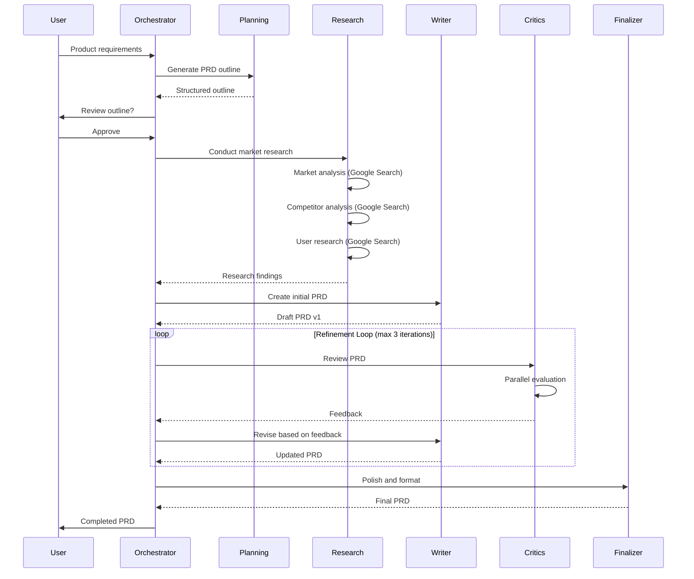

# Multi-Agent PRD Generation System Design

## Executive Summary

This document outlines the architecture and implementation of a sophisticated multi-agent system for generating Product Requirements Documents (PRDs) using Google ADK. The system employs multiple specialized agents with distinct roles, implements critic workflows for quality assurance, and leverages Google Search for real-time market intelligence.

## Table of Contents
1. [System Architecture](#system-architecture)
2. [Agent Roles and Responsibilities](#agent-roles-and-responsibilities)
3. [Agent Instructions and Prompts](#agent-instructions-and-prompts)
4. [Workflow Orchestration](#workflow-orchestration)
5. [State Management](#state-management)
6. [Structured Output Schemas](#structured-output-schemas)
7. [Google Search Integration](#google-search-integration)
8. [Critic Evaluation Framework](#critic-evaluation-framework)
9. [Loop Control Mechanisms](#loop-control-mechanisms)
10. [Implementation Guide](#implementation-guide)
11. [Deployment Strategy](#deployment-strategy)

## System Architecture

### Overall System Design

```
┌─────────────────────────────────────────────────────────────┐
│                    PRD Orchestrator Agent                    │
│                     (Root Coordinator)                       │
│         - Human-in-the-loop management                       │
│         - Workflow coordination                              │
│         - State persistence                                  │
└─────────────────┬───────────────────────────────────────────┘
                  │
    ┌─────────────┼─────────────┬──────────────┬─────────────┐
    ▼             ▼             ▼              ▼             ▼
┌─────────┐ ┌──────────┐ ┌──────────┐ ┌──────────┐ ┌──────────┐
│Planning │ │Research  │ │PRD Writer│ │Critics   │ │Finalizer │
│Agent    │ │Pipeline  │ │Agent     │ │Loop      │ │Agent     │
└─────────┘ └──────────┘ └──────────┘ └──────────┘ └──────────┘
               │                          │
               │                          ├── Director of Product
               │                          ├── Head of Design  
               │                          └── Head of Engineering
               │
               ├── Market Researcher (with Google Search)
               ├── Competitor Analyst (with Google Search)
               └── User Research Agent (with Google Search)
```

### Component Interaction Flow



## Agent Roles and Responsibilities

### 1. PRD Orchestrator Agent (Root)
- **Type**: LlmAgent with sub-agents
- **Model**: gemini-2.5-flash
- **Responsibilities**:
  - Overall workflow coordination
  - Human-in-the-loop interaction management
  - State persistence across all agents
  - Decision routing and escalation
  - Progress tracking and reporting

### 2. Planning Agent
- **Type**: LlmAgent
- **Model**: gemini-2.5-flash
- **Responsibilities**:
  - Decompose user requirements into structured plan
  - Identify PRD sections needed
  - Map research requirements
  - Create initial document outline
  - Define success criteria

### 3. Research Pipeline
- **Type**: SequentialAgent
- **Sub-agents**:

#### 3.1 Market Researcher
- **Tools**: Google Search
- **Focus**: Market size, trends, TAM/SAM/SOM analysis
- **Output**: Market opportunity assessment

#### 3.2 Competitor Analyst
- **Tools**: Google Search
- **Focus**: Competitive landscape, feature comparison
- **Output**: Competitive analysis matrix

#### 3.3 User Research Agent
- **Tools**: Google Search
- **Focus**: User needs, pain points, personas
- **Output**: User insights and personas

### 4. Senior PM Writer Agent
- **Type**: LlmAgent
- **Model**: gemini-2.5-pro
- **Responsibilities**:
  - Primary PRD authoring
  - Synthesize research into comprehensive document
  - Structure content per PRD template
  - Integrate critic feedback
  - Maintain consistency across revisions

### 5. Critics Loop
- **Type**: LoopAgent with ParallelAgent
- **Sub-agents**:

#### 5.1 Director of Product (Critic)
- **Focus**: Strategic alignment, business viability
- **Evaluation**: Market opportunity, monetization, OKRs

#### 5.2 Head of Design (Critic)
- **Focus**: User experience, design feasibility
- **Evaluation**: User journeys, accessibility, usability

#### 5.3 Head of Engineering (Critic)
- **Focus**: Technical feasibility, implementation complexity
- **Evaluation**: Architecture, scalability, security

### 6. Finalizer Agent
- **Type**: LlmAgent
- **Model**: gemini-2.5-flash
- **Responsibilities**:
  - Final formatting and polish
  - Citation management
  - Version documentation
  - Export to required formats

## Agent Instructions and Prompts

### PRD Orchestrator Agent
```python
ORCHESTRATOR_INSTRUCTION = """
You are the PRD Orchestration Manager, responsible for coordinating the entire 
Product Requirements Document creation process.

Your workflow:
1. **Understand Requirements**: Engage with the user to clarify product vision
2. **Plan Generation**: Delegate to Planning Agent for structured approach
3. **Research Coordination**: Trigger Research Pipeline for market insights
4. **Document Creation**: Guide Senior PM Writer through PRD authoring
5. **Review Management**: Orchestrate critic reviews and refinement loops
6. **Finalization**: Ensure document meets all quality standards

Key Responsibilities:
- Maintain conversation with user throughout process
- Present intermediate results for validation
- Manage state across all agent interactions
- Ensure comprehensive coverage of all PRD sections
- Track versions and changes

Human-in-the-Loop Checkpoints:
1. After planning phase - approve outline
2. After initial draft - review before critics
3. After critic feedback - approve revisions
4. Final approval before delivery

Current date: {datetime.now()}
"""
```

### Planning Agent
```python
PLANNING_AGENT_INSTRUCTION = """
You are a strategic planning specialist responsible for creating a comprehensive 
PRD outline based on user requirements.

Input: User's product vision and requirements
Output: Structured PRD outline with research needs

Your task:
1. Analyze the product requirements
2. Identify all necessary PRD sections
3. Map information gaps requiring research
4. Create detailed outline with subsections
5. Define success criteria for the PRD

PRD Sections to include:
- Executive Summary
- Problem Statement & Opportunity
- Target Users & Personas
- User Stories & Use Cases
- Functional Requirements
- Non-Functional Requirements
- Success Metrics & KPIs
- Dependencies & Risks
- Timeline & Milestones
- Technical Architecture (if applicable)
- Go-to-Market Strategy
- Open Questions & Assumptions

For each section, specify:
- Key questions to answer
- Research needs
- Data requirements
- Stakeholder input needed

Output format: Structured JSON with outline and research queries
"""
```

### Market Researcher Agent
```python
MARKET_RESEARCHER_INSTRUCTION = """
You are a Market Research Analyst with expertise in technology markets.

Your mission: Conduct comprehensive market research for the product concept.

Research Areas:
1. **Market Size & Growth**
   - TAM (Total Addressable Market)
   - SAM (Serviceable Addressable Market)
   - SOM (Serviceable Obtainable Market)
   - Growth projections and trends

2. **Market Dynamics**
   - Key drivers and restraints
   - Technology trends
   - Regulatory landscape
   - Economic factors

3. **Customer Segments**
   - Primary target segments
   - Segment size and characteristics
   - Buying behavior and preferences
   - Price sensitivity

4. **Industry Analysis**
   - Value chain analysis
   - Key success factors
   - Entry barriers
   - Substitutes and alternatives

Use Google Search to find:
- Industry reports and analyses
- Market research data
- Analyst opinions
- Recent news and developments
- Statistical data and forecasts

Output: Comprehensive market analysis with citations
Current date: {datetime.now()}
"""
```

### Competitor Analyst Agent
```python
COMPETITOR_ANALYST_INSTRUCTION = """
You are a Competitive Intelligence Analyst specializing in product strategy.

Your mission: Analyze the competitive landscape for the proposed product.

Analysis Framework:
1. **Direct Competitors**
   - Product features and capabilities
   - Pricing models and strategies
   - Market share and positioning
   - Strengths and weaknesses

2. **Indirect Competitors**
   - Alternative solutions
   - Substitute products
   - Adjacent market players

3. **Competitive Advantages**
   - Unique value propositions
   - Differentiation opportunities
   - Competitive moats
   - White space analysis

4. **Competitive Strategy**
   - Positioning recommendations
   - Feature priorities
   - Pricing strategy
   - Go-to-market approach

Search for:
- Competitor websites and documentation
- Product reviews and comparisons
- Pricing information
- Recent product launches
- Market share data
- Customer feedback and reviews

Create a detailed competitive analysis matrix with feature comparisons.
"""
```

### Senior PM Writer Agent
```python
SENIOR_PM_INSTRUCTION = """
You are a Senior Product Manager with 10+ years of experience creating 
world-class Product Requirements Documents for major tech companies.

Your task is to create a comprehensive PRD using:
- Market research findings from {market_research}
- Competitive analysis from {competitive_analysis}
- User research insights from {user_research}
- Product outline from {prd_outline}
- Critic feedback from {critic_feedback} (if revision)

PRD Writing Guidelines:
1. **Clarity**: Use clear, unambiguous language
2. **Specificity**: Be specific and measurable in requirements
3. **Completeness**: Cover all aspects comprehensively
4. **Prioritization**: Use MoSCoW method (Must/Should/Could/Won't have)
5. **Traceability**: Link requirements to user needs and business goals
6. **Testability**: Include acceptance criteria for each requirement

Document Structure:
1. Executive Summary (1 page max)
2. Problem Statement & Opportunity
   - Problem definition
   - Market opportunity
   - Strategic alignment
3. Target Users & Personas
   - User segments
   - Detailed personas
   - User journey maps
4. User Stories & Use Cases
   - Epic level stories
   - Detailed use cases
   - Edge cases
5. Functional Requirements
   - Core features
   - User interface requirements
   - Integration requirements
6. Non-Functional Requirements
   - Performance requirements
   - Security requirements
   - Compliance requirements
7. Success Metrics & KPIs
   - Business metrics
   - User metrics
   - Technical metrics
8. Dependencies & Risks
   - Technical dependencies
   - Business risks
   - Mitigation strategies
9. Timeline & Milestones
   - Development phases
   - Release milestones
   - Success criteria

Support all assertions with research data and include inline citations.
"""
```

### Director of Product Critic
```python
DIRECTOR_CRITIC_INSTRUCTION = """
You are a Director of Product reviewing a PRD for strategic alignment and 
business viability.

Evaluation Framework:

1. **Strategic Alignment** (Weight: 30%)
   - Alignment with company vision and mission
   - Support for OKRs and strategic initiatives
   - Portfolio fit and synergies
   - Long-term sustainability

2. **Market Opportunity** (Weight: 25%)
   - TAM/SAM/SOM validation
   - Market timing and readiness
   - Growth potential
   - Competitive positioning

3. **Business Model** (Weight: 20%)
   - Revenue model clarity
   - Unit economics
   - Pricing strategy
   - Customer acquisition strategy

4. **Risk Assessment** (Weight: 15%)
   - Risk identification completeness
   - Mitigation strategies
   - Dependencies management
   - Contingency planning

5. **Success Metrics** (Weight: 10%)
   - Metric relevance and measurability
   - Leading vs lagging indicators
   - Baseline establishment
   - Target setting rationale

Provide feedback as:
{
  "grade": "pass" or "needs_revision",
  "score": 0-100,
  "strategic_gaps": [...],
  "improvement_suggestions": [...],
  "priority_changes": [...],
  "commendations": [...]
}

Be constructive but thorough. If revision needed, provide specific guidance.
"""
```

### Head of Design Critic
```python
DESIGN_CRITIC_INSTRUCTION = """
You are a Head of Design reviewing a PRD for user experience and design feasibility.

Evaluation Framework:

1. **User-Centricity** (Weight: 30%)
   - User problem validation
   - Persona completeness and accuracy
   - User journey mapping
   - Pain point addressing

2. **Usability Standards** (Weight: 25%)
   - Interface requirements clarity
   - Interaction patterns
   - Information architecture
   - Error handling and recovery

3. **Accessibility** (Weight: 20%)
   - WCAG compliance requirements
   - Inclusive design considerations
   - Multi-device support
   - Internationalization needs

4. **Design Feasibility** (Weight: 15%)
   - Design system alignment
   - Component reusability
   - Visual hierarchy
   - Brand consistency

5. **User Research** (Weight: 10%)
   - Research methodology
   - Sample size and diversity
   - Insights integration
   - Validation approach

Provide feedback focusing on:
- Missing UX considerations
- Potential usability issues
- Design complexity concerns
- User testing recommendations
- Accessibility gaps

Output format: Structured feedback with specific improvement areas
"""
```

### Head of Engineering Critic
```python
ENGINEERING_CRITIC_INSTRUCTION = """
You are a Head of Engineering reviewing a PRD for technical feasibility and 
implementation considerations.

Evaluation Framework:

1. **Technical Feasibility** (Weight: 30%)
   - Architecture compatibility
   - Technology stack alignment
   - Integration complexity
   - Performance requirements

2. **Scalability** (Weight: 25%)
   - Load projections
   - Database design implications
   - Caching strategies
   - Infrastructure requirements

3. **Security** (Weight: 20%)
   - Security requirements completeness
   - Data privacy considerations
   - Authentication/authorization needs
   - Compliance requirements

4. **Development Effort** (Weight: 15%)
   - Effort estimation accuracy
   - Resource requirements
   - Skill set availability
   - Timeline realism

5. **Technical Debt** (Weight: 10%)
   - Debt implications
   - Maintenance considerations
   - Documentation needs
   - Testing requirements

Assess and provide:
- Technical risk areas
- Architecture recommendations
- Alternative implementation approaches
- Resource and timeline adjustments
- Testing strategy suggestions

Include specific technical concerns and constructive solutions.
"""
```

## Workflow Orchestration

### Implementation Using Google ADK

```python
from google.adk.agents import (
    LlmAgent, SequentialAgent, LoopAgent, ParallelAgent
)
from google.adk.tools import google_search, AgentTool
from google.adk.events import Event, EventActions
from google.adk.planners import BuiltInPlanner
from google.genai import types as genai_types
from pydantic import BaseModel, Field
from typing import Literal, Optional
import datetime

# Configuration
class PRDConfig:
    orchestrator_model = "gemini-2.5-flash"
    writer_model = "gemini-2.5-pro"
    critic_model = "gemini-2.5-pro"
    researcher_model = "gemini-2.5-flash"
    max_refinement_iterations = 3
    require_unanimous_approval = False  # If True, all critics must pass

config = PRDConfig()

# Planning Agent
planning_agent = LlmAgent(
    name="planning_agent",
    model=config.orchestrator_model,
    description="Creates structured PRD outline from requirements",
    instruction=PLANNING_AGENT_INSTRUCTION,
    output_key="prd_outline",
    output_schema=PRDOutline
)

# Research Agents with Google Search
market_researcher = LlmAgent(
    name="market_researcher",
    model=config.researcher_model,
    description="Conducts market research and analysis",
    instruction=MARKET_RESEARCHER_INSTRUCTION,
    tools=[google_search],
    planner=BuiltInPlanner(
        thinking_config=genai_types.ThinkingConfig(include_thoughts=True)
    ),
    output_key="market_research",
    after_agent_callback=collect_research_sources_callback
)

competitor_analyst = LlmAgent(
    name="competitor_analyst",
    model=config.researcher_model,
    description="Analyzes competitive landscape",
    instruction=COMPETITOR_ANALYST_INSTRUCTION,
    tools=[google_search],
    planner=BuiltInPlanner(
        thinking_config=genai_types.ThinkingConfig(include_thoughts=True)
    ),
    output_key="competitive_analysis",
    after_agent_callback=collect_research_sources_callback
)

user_researcher = LlmAgent(
    name="user_researcher",
    model=config.researcher_model,
    description="Researches user needs and personas",
    instruction=USER_RESEARCHER_INSTRUCTION,
    tools=[google_search],
    output_key="user_research",
    after_agent_callback=collect_research_sources_callback
)

# Research Pipeline
research_pipeline = SequentialAgent(
    name="research_pipeline",
    description="Conducts comprehensive market and user research",
    sub_agents=[
        market_researcher,
        competitor_analyst,
        user_researcher
    ]
)

# Senior PM Writer
senior_pm_writer = LlmAgent(
    name="senior_pm_writer",
    model=config.writer_model,
    description="Creates and refines PRD document",
    instruction=SENIOR_PM_INSTRUCTION,
    planner=BuiltInPlanner(
        thinking_config=genai_types.ThinkingConfig(include_thoughts=True)
    ),
    output_key="current_prd_draft",
    after_agent_callback=version_tracking_callback
)

# Critic Agents
director_critic = LlmAgent(
    name="director_of_product_critic",
    model=config.critic_model,
    description="Reviews PRD for strategic alignment",
    instruction=DIRECTOR_CRITIC_INSTRUCTION,
    output_schema=CriticFeedback,
    output_key="director_feedback"
)

design_critic = LlmAgent(
    name="head_of_design_critic",
    model=config.critic_model,
    description="Reviews PRD for UX and design",
    instruction=DESIGN_CRITIC_INSTRUCTION,
    output_schema=CriticFeedback,
    output_key="design_feedback"
)

engineering_critic = LlmAgent(
    name="head_of_engineering_critic",
    model=config.critic_model,
    description="Reviews PRD for technical feasibility",
    instruction=ENGINEERING_CRITIC_INSTRUCTION,
    output_schema=CriticFeedback,
    output_key="engineering_feedback"
)

# Parallel Critics Review
critics_parallel = ParallelAgent(
    name="critics_review",
    description="Parallel review by all critic agents",
    sub_agents=[
        director_critic,
        design_critic,
        engineering_critic
    ]
)

# Feedback Consolidator
feedback_consolidator = LlmAgent(
    name="feedback_consolidator",
    model=config.orchestrator_model,
    description="Consolidates and prioritizes critic feedback",
    instruction=FEEDBACK_CONSOLIDATOR_INSTRUCTION,
    output_key="consolidated_feedback",
    output_schema=ConsolidatedFeedback
)

# Escalation Checker
class PRDEscalationChecker(BaseAgent):
    """Controls refinement loop based on critic consensus"""
    
    def __init__(self, name: str, require_unanimous: bool = False):
        super().__init__(name=name)
        self.require_unanimous = require_unanimous
    
    async def _run_async_impl(self, ctx: InvocationContext):
        feedback = ctx.session.state.get("consolidated_feedback", {})
        
        # Check if critics passed
        if self.require_unanimous:
            all_passed = all(
                f.get("grade") == "pass" 
                for f in [
                    ctx.session.state.get("director_feedback"),
                    ctx.session.state.get("design_feedback"),
                    ctx.session.state.get("engineering_feedback")
                ]
            )
        else:
            # Majority approval (2 out of 3)
            pass_count = sum(
                1 for f in [
                    ctx.session.state.get("director_feedback"),
                    ctx.session.state.get("design_feedback"),
                    ctx.session.state.get("engineering_feedback")
                ] if f.get("grade") == "pass"
            )
            all_passed = pass_count >= 2
        
        # Check iteration limit
        current_iteration = ctx.session.state.get("refinement_iteration", 0)
        
        if all_passed or current_iteration >= config.max_refinement_iterations:
            # Escalate to stop loop
            yield Event(
                author=self.name,
                actions=EventActions(escalate=True),
                content=f"Refinement complete: {'Critics approved' if all_passed else 'Max iterations reached'}"
            )
        else:
            # Continue refinement
            ctx.session.state["refinement_iteration"] = current_iteration + 1
            yield Event(
                author=self.name,
                content=f"Continuing refinement (iteration {current_iteration + 1}/{config.max_refinement_iterations})"
            )

# Refinement Loop
refinement_loop = LoopAgent(
    name="prd_refinement_loop",
    max_iterations=config.max_refinement_iterations,
    sub_agents=[
        critics_parallel,
        feedback_consolidator,
        PRDEscalationChecker(
            name="escalation_checker",
            require_unanimous=config.require_unanimous_approval
        ),
        senior_pm_writer  # Revises based on feedback
    ]
)

# Finalizer Agent
finalizer_agent = LlmAgent(
    name="finalizer_agent",
    model=config.orchestrator_model,
    description="Finalizes PRD with formatting and citations",
    instruction=FINALIZER_INSTRUCTION,
    output_key="final_prd",
    after_agent_callback=export_prd_callback
)

# Main PRD Workflow
prd_workflow = SequentialAgent(
    name="prd_generation_workflow",
    description="Complete PRD generation workflow",
    sub_agents=[
        planning_agent,
        research_pipeline,
        senior_pm_writer,  # Initial draft
        refinement_loop,   # Critic reviews and revisions
        finalizer_agent    # Final polish
    ]
)

# Root Orchestrator
prd_orchestrator = LlmAgent(
    name="prd_orchestrator",
    model=config.orchestrator_model,
    description="Orchestrates the entire PRD creation process",
    instruction=ORCHESTRATOR_INSTRUCTION,
    sub_agents=[prd_workflow],
    tools=[
        AgentTool(
            agent=planning_agent,
            name="create_outline",
            description="Create PRD outline from requirements"
        ),
        AgentTool(
            agent=prd_workflow,
            name="generate_prd",
            description="Execute full PRD generation workflow"
        )
    ]
)

# Export as root agent
root_agent = prd_orchestrator
```

## State Management

### State Schema Definition

```python
from dataclasses import dataclass
from datetime import datetime
from typing import Dict, List, Optional, Any

@dataclass
class PRDState:
    """Complete state management for PRD generation"""
    
    # User Input
    product_vision: str
    target_market: str
    key_requirements: List[str]
    constraints: Dict[str, Any]
    
    # Planning Output
    prd_outline: Dict[str, Any]
    research_queries: List[str]
    success_criteria: List[str]
    
    # Research Results
    market_research: Dict[str, Any]
    competitive_analysis: Dict[str, Any]
    user_research: Dict[str, Any]
    research_sources: Dict[str, Dict]  # source_id -> source_info
    
    # PRD Drafts
    current_draft: str
    draft_version: int
    section_status: Dict[str, str]  # section -> completion_status
    revision_history: List[Dict[str, Any]]
    
    # Critic Feedback
    director_feedback: Optional[Dict]
    design_feedback: Optional[Dict]
    engineering_feedback: Optional[Dict]
    consolidated_feedback: Optional[Dict]
    feedback_rounds: List[Dict[str, Any]]
    
    # Refinement Tracking
    refinement_iteration: int
    revision_priorities: List[str]
    resolved_issues: List[str]
    pending_issues: List[str]
    
    # Metadata
    session_id: str
    created_at: datetime
    last_modified: datetime
    approval_status: str
    human_checkpoints: List[Dict[str, Any]]
    
    # Final Output
    final_prd: Optional[str]
    export_formats: List[str]
    published_url: Optional[str]
```

### State Management Callbacks

```python
from google.adk.agents.callback_context import CallbackContext
from google.adk.context import ToolContext
import json
from datetime import datetime

def collect_research_sources_callback(callback_context: CallbackContext) -> None:
    """Collects and stores research sources for citations"""
    sources = callback_context.state.get("research_sources", {})
    source_counter = len(sources)
    
    for event in callback_context._invocation_context.session.events:
        if not (event.grounding_metadata and event.grounding_metadata.grounding_chunks):
            continue
            
        for chunk in event.grounding_metadata.grounding_chunks:
            if not chunk.web:
                continue
                
            source_id = f"src-{source_counter + 1}"
            sources[source_id] = {
                "id": source_id,
                "url": chunk.web.uri,
                "title": chunk.web.title,
                "domain": chunk.web.domain,
                "agent": callback_context._invocation_context.agent.name,
                "timestamp": datetime.now().isoformat(),
                "confidence": chunk.confidence_score if hasattr(chunk, 'confidence_score') else None
            }
            source_counter += 1
    
    callback_context.state["research_sources"] = sources
    callback_context.state["source_count"] = source_counter

def version_tracking_callback(callback_context: CallbackContext) -> None:
    """Tracks PRD versions and changes"""
    
    # Initialize version tracking
    if "draft_version" not in callback_context.state:
        callback_context.state["draft_version"] = 1
        callback_context.state["revision_history"] = []
    else:
        callback_context.state["draft_version"] += 1
    
    # Store current draft as artifact
    current_draft = callback_context.state.get("current_prd_draft", "")
    if current_draft:
        version = callback_context.state["draft_version"]
        
        # Save artifact
        callback_context.save_artifact(
            filename=f"prd_v{version}.md",
            content=current_draft.encode(),
            mime_type="text/markdown"
        )
        
        # Track revision history
        revision_entry = {
            "version": version,
            "timestamp": datetime.now().isoformat(),
            "author": callback_context._invocation_context.agent.name,
            "changes_summary": extract_changes_summary(callback_context),
            "feedback_addressed": callback_context.state.get("consolidated_feedback", {})
        }
        callback_context.state["revision_history"].append(revision_entry)
    
    # Update section completion status
    update_section_status(callback_context, current_draft)

def extract_changes_summary(context: CallbackContext) -> str:
    """Extract summary of changes from feedback"""
    feedback = context.state.get("consolidated_feedback", {})
    if not feedback:
        return "Initial draft created"
    
    changes = []
    if feedback.get("strategic_changes"):
        changes.extend(feedback["strategic_changes"])
    if feedback.get("design_changes"):
        changes.extend(feedback["design_changes"])
    if feedback.get("technical_changes"):
        changes.extend(feedback["technical_changes"])
    
    return "; ".join(changes[:5])  # Top 5 changes

def update_section_status(context: CallbackContext, draft: str) -> None:
    """Track completion status of PRD sections"""
    sections = [
        "Executive Summary",
        "Problem Statement",
        "Target Users",
        "User Stories",
        "Functional Requirements",
        "Non-Functional Requirements",
        "Success Metrics",
        "Dependencies",
        "Timeline"
    ]
    
    section_status = {}
    for section in sections:
        if section.lower() in draft.lower():
            # Check if section has substantial content
            section_status[section] = "complete" if len(draft) > 100 else "partial"
        else:
            section_status[section] = "pending"
    
    context.state["section_status"] = section_status

def export_prd_callback(callback_context: CallbackContext) -> None:
    """Handles final PRD export and formatting"""
    final_prd = callback_context.state.get("final_prd", "")
    
    if final_prd:
        # Save final version
        callback_context.save_artifact(
            filename="prd_final.md",
            content=final_prd.encode(),
            mime_type="text/markdown"
        )
        
        # Generate additional formats if needed
        # PDF generation would go here
        # callback_context.save_artifact("prd_final.pdf", pdf_bytes, "application/pdf")
        
        # Update metadata
        callback_context.state["approval_status"] = "complete"
        callback_context.state["completion_time"] = datetime.now().isoformat()
        callback_context.state["total_iterations"] = callback_context.state.get("refinement_iteration", 0)
```

### Human-in-the-Loop Checkpoints

```python
class HumanCheckpoint(BaseAgent):
    """Implements human approval checkpoints"""
    
    def __init__(self, name: str, checkpoint_type: str):
        super().__init__(name=name)
        self.checkpoint_type = checkpoint_type
    
    async def _run_async_impl(self, ctx: InvocationContext):
        checkpoint_data = {
            "type": self.checkpoint_type,
            "timestamp": datetime.now().isoformat(),
            "state_snapshot": self._capture_state(ctx)
        }
        
        # Add to checkpoint history
        checkpoints = ctx.session.state.get("human_checkpoints", [])
        checkpoints.append(checkpoint_data)
        ctx.session.state["human_checkpoints"] = checkpoints
        
        # Present for approval
        if self.checkpoint_type == "outline_approval":
            content = f"Please review the PRD outline:\n{ctx.session.state.get('prd_outline')}"
        elif self.checkpoint_type == "draft_approval":
            content = f"Please review the initial PRD draft (version {ctx.session.state.get('draft_version')})"
        elif self.checkpoint_type == "final_approval":
            content = "Please review the final PRD for approval"
        else:
            content = "Please review and approve to continue"
        
        yield Event(
            author=self.name,
            content=content,
            actions=EventActions(
                require_user_input=True,
                checkpoint_type=self.checkpoint_type
            )
        )
    
    def _capture_state(self, ctx: InvocationContext) -> Dict:
        """Capture relevant state for checkpoint"""
        return {
            "draft_version": ctx.session.state.get("draft_version"),
            "section_status": ctx.session.state.get("section_status"),
            "approval_status": ctx.session.state.get("approval_status")
        }
```

## Structured Output Schemas

### Pydantic Models for Type Safety

```python
from pydantic import BaseModel, Field, validator
from typing import List, Optional, Literal, Dict, Any
from datetime import datetime

# Planning Schemas
class PRDSection(BaseModel):
    """Individual PRD section structure"""
    name: str = Field(description="Section name")
    description: str = Field(description="Section purpose")
    key_questions: List[str] = Field(description="Questions to answer")
    research_needed: bool = Field(default=False)
    priority: Literal["high", "medium", "low"]
    dependencies: List[str] = Field(default_factory=list)

class PRDOutline(BaseModel):
    """Complete PRD outline structure"""
    product_name: str
    vision_statement: str
    sections: List[PRDSection]
    research_queries: List[str]
    success_criteria: List[str]
    estimated_completion_time: str
    
    @validator('sections')
    def validate_required_sections(cls, v):
        required = ["Executive Summary", "Problem Statement", "Requirements"]
        section_names = [s.name for s in v]
        for req in required:
            if req not in section_names:
                raise ValueError(f"Missing required section: {req}")
        return v

# Research Schemas
class MarketSegment(BaseModel):
    """Market segment definition"""
    name: str
    size: str
    growth_rate: str
    characteristics: List[str]
    opportunities: List[str]

class MarketResearch(BaseModel):
    """Market research findings"""
    tam: str = Field(description="Total Addressable Market")
    sam: str = Field(description="Serviceable Addressable Market")
    som: str = Field(description="Serviceable Obtainable Market")
    growth_projection: str
    key_trends: List[str]
    market_segments: List[MarketSegment]
    opportunities: List[str]
    threats: List[str]
    sources: List[str]

class CompetitorProfile(BaseModel):
    """Individual competitor analysis"""
    name: str
    market_share: Optional[str]
    key_features: List[str]
    pricing_model: str
    strengths: List[str]
    weaknesses: List[str]
    differentiators: List[str]

class CompetitiveAnalysis(BaseModel):
    """Complete competitive landscape"""
    direct_competitors: List[CompetitorProfile]
    indirect_competitors: List[CompetitorProfile]
    feature_comparison_matrix: Dict[str, Dict[str, bool]]
    competitive_advantages: List[str]
    market_gaps: List[str]
    positioning_strategy: str

class UserPersona(BaseModel):
    """User persona definition"""
    name: str
    role: str
    demographics: Dict[str, str]
    goals: List[str]
    pain_points: List[str]
    use_cases: List[str]
    quote: Optional[str]

class UserResearch(BaseModel):
    """User research findings"""
    primary_personas: List[UserPersona]
    secondary_personas: List[UserPersona]
    user_journey_stages: List[str]
    key_pain_points: List[str]
    desired_outcomes: List[str]
    adoption_barriers: List[str]

# PRD Content Schemas
class UserStory(BaseModel):
    """User story format"""
    id: str
    persona: str
    story: str = Field(description="As a [persona], I want [goal] so that [benefit]")
    acceptance_criteria: List[str]
    priority: Literal["must_have", "should_have", "could_have", "wont_have"]
    effort_points: Optional[int]

class FunctionalRequirement(BaseModel):
    """Functional requirement specification"""
    id: str = Field(description="Unique requirement ID")
    category: str
    title: str
    description: str
    user_story_ids: List[str]
    acceptance_criteria: List[str]
    priority: Literal["must_have", "should_have", "could_have", "wont_have"]
    dependencies: List[str] = Field(default_factory=list)
    effort_estimate: str
    
    @validator('id')
    def validate_id_format(cls, v):
        if not v.startswith("FR-"):
            raise ValueError("Functional requirement ID must start with 'FR-'")
        return v

class NonFunctionalRequirement(BaseModel):
    """Non-functional requirement specification"""
    id: str = Field(description="Unique requirement ID")
    category: Literal["performance", "security", "usability", "reliability", "scalability", "compliance"]
    title: str
    description: str
    measurement_criteria: str
    target_value: str
    priority: Literal["must_have", "should_have", "could_have", "wont_have"]
    
    @validator('id')
    def validate_id_format(cls, v):
        if not v.startswith("NFR-"):
            raise ValueError("Non-functional requirement ID must start with 'NFR-'")
        return v

class SuccessMetric(BaseModel):
    """Success metric definition"""
    name: str
    category: Literal["business", "user", "technical", "operational"]
    description: str
    measurement_method: str
    current_baseline: Optional[str]
    target_value: str
    target_timeframe: str
    tracking_frequency: str

class Risk(BaseModel):
    """Risk assessment"""
    id: str
    category: Literal["technical", "business", "operational", "compliance", "security"]
    description: str
    probability: Literal["low", "medium", "high"]
    impact: Literal["low", "medium", "high"]
    mitigation_strategy: str
    owner: str
    contingency_plan: Optional[str]

class Milestone(BaseModel):
    """Project milestone"""
    name: str
    date: str
    deliverables: List[str]
    success_criteria: List[str]
    dependencies: List[str]
    risks: List[str]

# Critic Feedback Schemas
class CriticFeedback(BaseModel):
    """Individual critic feedback"""
    critic_role: str
    grade: Literal["pass", "needs_revision"]
    score: int = Field(ge=0, le=100)
    category_scores: Dict[str, int]
    issues_found: List[str]
    suggestions: List[str]
    commendations: List[str]
    priority_changes: List[str]
    
    @validator('score')
    def validate_grade_score_consistency(cls, v, values):
        if values.get('grade') == 'pass' and v < 70:
            raise ValueError("Pass grade requires score >= 70")
        return v

class ConsolidatedFeedback(BaseModel):
    """Consolidated feedback from all critics"""
    overall_grade: Literal["pass", "needs_revision"]
    average_score: float
    consensus_issues: List[str]
    priority_revisions: List[str]
    strategic_changes: List[str]
    design_changes: List[str]
    technical_changes: List[str]
    unanimous_approvals: List[str]
    conflicting_feedback: List[Dict[str, str]]

# Final PRD Schema
class ProductRequirementsDocument(BaseModel):
    """Complete PRD structure"""
    metadata: Dict[str, Any]
    executive_summary: str
    problem_statement: str
    market_opportunity: MarketResearch
    competitive_landscape: CompetitiveAnalysis
    target_users: UserResearch
    user_stories: List[UserStory]
    functional_requirements: List[FunctionalRequirement]
    non_functional_requirements: List[NonFunctionalRequirement]
    success_metrics: List[SuccessMetric]
    risks: List[Risk]
    timeline: List[Milestone]
    dependencies: List[str]
    assumptions: List[str]
    open_questions: List[str]
    appendices: List[Dict[str, Any]]
    
    def to_markdown(self) -> str:
        """Convert PRD to markdown format"""
        # Implementation for markdown conversion
        pass
    
    def validate_completeness(self) -> Dict[str, bool]:
        """Validate PRD completeness"""
        return {
            "has_executive_summary": bool(self.executive_summary),
            "has_requirements": len(self.functional_requirements) > 0,
            "has_metrics": len(self.success_metrics) > 0,
            "has_timeline": len(self.timeline) > 0,
            "has_risks": len(self.risks) > 0
        }
```

## Google Search Integration

### Search Tool Implementation

```python
from google.adk.tools import google_search, tool
from google.adk.context import ToolContext
from typing import List, Dict, Any
import json

class EnhancedSearchTools:
    """Enhanced search tools for PRD research"""
    
    @staticmethod
    @tool
    def market_research_search(context: ToolContext, query: str, num_results: int = 10) -> Dict[str, Any]:
        """Specialized search for market research"""
        
        # Enhance query with market research terms
        enhanced_query = f"{query} market size TAM analysis industry report statistics"
        
        # Store search query for tracking
        searches = context.state.get("research_searches", [])
        searches.append({
            "type": "market_research",
            "query": enhanced_query,
            "timestamp": datetime.now().isoformat()
        })
        context.state["research_searches"] = searches
        
        # Note: actual search would use google_search tool
        # This is a structural example
        return {
            "query": enhanced_query,
            "results": "Market research findings",
            "sources": ["source1", "source2"]
        }
    
    @staticmethod
    @tool
    def competitor_search(context: ToolContext, competitor_name: str) -> Dict[str, Any]:
        """Targeted competitor research"""
        
        queries = [
            f"{competitor_name} features pricing",
            f"{competitor_name} reviews comparison",
            f"{competitor_name} market share revenue",
            f"{competitor_name} customer feedback"
        ]
        
        results = {}
        for query in queries:
            # Track search
            searches = context.state.get("research_searches", [])
            searches.append({
                "type": "competitor_analysis",
                "query": query,
                "target": competitor_name,
                "timestamp": datetime.now().isoformat()
            })
            context.state["research_searches"] = searches
            
            # Collect results (would use actual google_search)
            results[query] = "Search results"
        
        return {
            "competitor": competitor_name,
            "findings": results
        }

# Integration with Research Agents
def create_research_agent_with_search(
    name: str,
    instruction: str,
    search_focus: str
) -> LlmAgent:
    """Factory for creating research agents with search capabilities"""
    
    return LlmAgent(
        name=name,
        model="gemini-2.5-flash",
        description=f"Research agent focused on {search_focus}",
        instruction=instruction,
        tools=[google_search],  # Built-in Google Search
        planner=BuiltInPlanner(
            thinking_config=genai_types.ThinkingConfig(
                include_thoughts=True,
                thought_generation_prompt=f"Think about {search_focus} research strategy"
            )
        ),
        output_key=f"{name}_findings",
        after_agent_callback=collect_research_sources_callback
    )

# Source Citation Management
class CitationManager:
    """Manages citations and references from search results"""
    
    @staticmethod
    def process_grounding_metadata(event) -> Dict[str, Any]:
        """Extract citation information from grounding metadata"""
        citations = []
        
        if event.grounding_metadata and event.grounding_metadata.grounding_chunks:
            for chunk in event.grounding_metadata.grounding_chunks:
                if chunk.web:
                    citation = {
                        "url": chunk.web.uri,
                        "title": chunk.web.title,
                        "domain": chunk.web.domain,
                        "snippet": chunk.text if hasattr(chunk, 'text') else None,
                        "confidence": chunk.confidence_score if hasattr(chunk, 'confidence_score') else None
                    }
                    citations.append(citation)
        
        return citations
    
    @staticmethod
    def format_citation(citation: Dict[str, Any], style: str = "markdown") -> str:
        """Format citation for inclusion in PRD"""
        if style == "markdown":
            return f"[{citation['title']}]({citation['url']})"
        elif style == "apa":
            return f"{citation['domain']}. ({datetime.now().year}). {citation['title']}. Retrieved from {citation['url']}"
        else:
            return citation['url']
    
    @staticmethod
    def inject_citations(content: str, citations: List[Dict[str, Any]]) -> str:
        """Inject citations into PRD content"""
        # Replace citation tags with formatted citations
        for i, citation in enumerate(citations, 1):
            tag = f"<cite:{i}>"
            formatted = CitationManager.format_citation(citation)
            content = content.replace(tag, formatted)
        
        return content
```

## Critic Evaluation Framework

### Multi-Dimensional Evaluation System

```python
class CriticEvaluationFramework:
    """Comprehensive evaluation framework for PRD critics"""
    
    EVALUATION_CRITERIA = {
        "strategic_alignment": {
            "director_of_product": {
                "weight": 0.40,
                "criteria": [
                    ("vision_alignment", "Aligns with company vision and strategy"),
                    ("market_opportunity", "Addresses significant market opportunity"),
                    ("competitive_positioning", "Creates competitive advantage"),
                    ("business_model", "Has viable business model"),
                    ("resource_roi", "Justifies resource investment")
                ]
            }
        },
        "user_experience": {
            "head_of_design": {
                "weight": 0.35,
                "criteria": [
                    ("user_problem_fit", "Solves real user problems"),
                    ("usability", "Meets usability standards"),
                    ("accessibility", "Includes accessibility requirements"),
                    ("design_feasibility", "Feasible within design constraints"),
                    ("user_delight", "Creates delightful user experience")
                ]
            }
        },
        "technical_feasibility": {
            "head_of_engineering": {
                "weight": 0.35,
                "criteria": [
                    ("architecture_fit", "Fits existing architecture"),
                    ("performance", "Meets performance requirements"),
                    ("scalability", "Scales appropriately"),
                    ("security", "Addresses security concerns"),
                    ("technical_debt", "Minimizes technical debt")
                ]
            }
        }
    }
    
    @classmethod
    def evaluate(cls, prd_content: str, role: str) -> CriticFeedback:
        """Evaluate PRD based on role-specific criteria"""
        
        role_criteria = cls._get_role_criteria(role)
        scores = {}
        issues = []
        suggestions = []
        
        for category, specs in role_criteria.items():
            category_score = 0
            for criterion_id, criterion_desc in specs["criteria"]:
                # Evaluate each criterion (0-100)
                score = cls._evaluate_criterion(prd_content, criterion_id, criterion_desc)
                category_score += score
                
                if score < 70:
                    issues.append(f"{criterion_desc}: Score {score}/100")
                    suggestions.append(cls._generate_suggestion(criterion_id))
            
            # Average score for category
            scores[category] = category_score / len(specs["criteria"])
        
        # Calculate weighted overall score
        overall_score = sum(
            scores[cat] * specs["weight"] 
            for cat, specs in role_criteria.items()
        )
        
        return CriticFeedback(
            critic_role=role,
            grade="pass" if overall_score >= 75 else "needs_revision",
            score=int(overall_score),
            category_scores=scores,
            issues_found=issues,
            suggestions=suggestions,
            commendations=cls._identify_strengths(scores),
            priority_changes=issues[:3]  # Top 3 issues
        )
    
    @staticmethod
    def _evaluate_criterion(content: str, criterion_id: str, description: str) -> int:
        """Evaluate a specific criterion"""
        # Simplified evaluation logic
        # In practice, this would use NLP analysis
        
        keyword_scores = {
            "vision_alignment": ["vision", "strategy", "mission", "goals"],
            "market_opportunity": ["TAM", "SAM", "market size", "growth"],
            "user_problem_fit": ["pain point", "user need", "problem", "solution"],
            "architecture_fit": ["architecture", "integration", "API", "microservice"],
            # ... more keyword mappings
        }
        
        keywords = keyword_scores.get(criterion_id, [])
        matches = sum(1 for kw in keywords if kw.lower() in content.lower())
        
        # Score based on keyword presence (simplified)
        base_score = min(matches * 20, 60)
        
        # Add score for section completeness
        if f"## {criterion_id.replace('_', ' ').title()}" in content:
            base_score += 20
        
        # Add score for detail level
        section_length = len(content.split(criterion_id))
        if section_length > 2:
            base_score += 20
        
        return min(base_score, 100)
    
    @staticmethod
    def _generate_suggestion(criterion_id: str) -> str:
        """Generate improvement suggestion for criterion"""
        suggestions = {
            "vision_alignment": "Add explicit connection to company OKRs and strategic initiatives",
            "market_opportunity": "Include quantitative market data with TAM/SAM/SOM analysis",
            "user_problem_fit": "Add user research data and specific pain point validation",
            "architecture_fit": "Provide architecture diagrams and integration points",
            # ... more suggestions
        }
        return suggestions.get(criterion_id, f"Improve {criterion_id.replace('_', ' ')}")
    
    @staticmethod
    def _identify_strengths(scores: Dict[str, float]) -> List[str]:
        """Identify areas of strength"""
        strengths = []
        for category, score in scores.items():
            if score >= 85:
                strengths.append(f"Excellent {category.replace('_', ' ')}")
            elif score >= 75:
                strengths.append(f"Good {category.replace('_', ' ')}")
        return strengths

# Feedback Consolidation
class FeedbackConsolidator:
    """Consolidates feedback from multiple critics"""
    
    @staticmethod
    def consolidate(
        director_feedback: CriticFeedback,
        design_feedback: CriticFeedback,
        engineering_feedback: CriticFeedback
    ) -> ConsolidatedFeedback:
        """Consolidate feedback from all critics"""
        
        all_feedback = [director_feedback, design_feedback, engineering_feedback]
        
        # Calculate consensus
        overall_grade = "pass" if sum(
            1 for f in all_feedback if f.grade == "pass"
        ) >= 2 else "needs_revision"
        
        # Average scores
        average_score = sum(f.score for f in all_feedback) / len(all_feedback)
        
        # Find consensus issues (mentioned by 2+ critics)
        all_issues = []
        for feedback in all_feedback:
            all_issues.extend(feedback.issues_found)
        
        issue_counts = {}
        for issue in all_issues:
            issue_counts[issue] = issue_counts.get(issue, 0) + 1
        
        consensus_issues = [
            issue for issue, count in issue_counts.items() if count >= 2
        ]
        
        # Categorize changes
        strategic_changes = director_feedback.suggestions
        design_changes = design_feedback.suggestions
        technical_changes = engineering_feedback.suggestions
        
        # Identify conflicts
        conflicts = FeedbackConsolidator._identify_conflicts(all_feedback)
        
        # Find unanimous approvals
        unanimous = FeedbackConsolidator._find_unanimous_approvals(all_feedback)
        
        return ConsolidatedFeedback(
            overall_grade=overall_grade,
            average_score=average_score,
            consensus_issues=consensus_issues,
            priority_revisions=consensus_issues[:5],  # Top 5 consensus issues
            strategic_changes=strategic_changes,
            design_changes=design_changes,
            technical_changes=technical_changes,
            unanimous_approvals=unanimous,
            conflicting_feedback=conflicts
        )
    
    @staticmethod
    def _identify_conflicts(feedback_list: List[CriticFeedback]) -> List[Dict[str, str]]:
        """Identify conflicting feedback between critics"""
        conflicts = []
        
        # Compare pairs of feedback
        for i, feedback1 in enumerate(feedback_list):
            for feedback2 in feedback_list[i+1:]:
                # Check for opposing suggestions
                for sug1 in feedback1.suggestions:
                    for sug2 in feedback2.suggestions:
                        if FeedbackConsolidator._are_conflicting(sug1, sug2):
                            conflicts.append({
                                "critic1": feedback1.critic_role,
                                "suggestion1": sug1,
                                "critic2": feedback2.critic_role,
                                "suggestion2": sug2
                            })
        
        return conflicts
    
    @staticmethod
    def _are_conflicting(sug1: str, sug2: str) -> bool:
        """Detect if two suggestions conflict"""
        # Simplified conflict detection
        opposing_terms = [
            ("increase", "decrease"),
            ("add", "remove"),
            ("expand", "simplify"),
            ("more detail", "less detail")
        ]
        
        for term1, term2 in opposing_terms:
            if (term1 in sug1.lower() and term2 in sug2.lower()) or \
               (term2 in sug1.lower() and term1 in sug2.lower()):
                return True
        
        return False
    
    @staticmethod
    def _find_unanimous_approvals(feedback_list: List[CriticFeedback]) -> List[str]:
        """Find areas with unanimous approval"""
        approvals = []
        
        # Check commendations across all critics
        all_commendations = set()
        for feedback in feedback_list:
            all_commendations.update(feedback.commendations)
        
        # Find common commendations
        for commendation in all_commendations:
            if all(commendation in f.commendations for f in feedback_list):
                approvals.append(commendation)
        
        return approvals
```

## Loop Control Mechanisms

### Advanced Loop Control Implementation

```python
from google.adk.agents import BaseAgent
from google.adk.agents.invocation_context import InvocationContext
from google.adk.events import Event, EventActions
from typing import Dict, Any
import logging

class AdvancedLoopController:
    """Advanced loop control for refinement iterations"""
    
    def __init__(self, config: Dict[str, Any]):
        self.max_iterations = config.get("max_iterations", 3)
        self.min_score_threshold = config.get("min_score_threshold", 75)
        self.require_unanimous = config.get("require_unanimous", False)
        self.allow_override = config.get("allow_override", True)
        self.improvement_threshold = config.get("improvement_threshold", 5)
    
    def should_continue(self, context: InvocationContext) -> bool:
        """Determine if refinement should continue"""
        
        # Get current state
        iteration = context.session.state.get("refinement_iteration", 0)
        feedback = context.session.state.get("consolidated_feedback", {})
        history = context.session.state.get("score_history", [])
        
        # Check hard limits
        if iteration >= self.max_iterations:
            logging.info(f"Max iterations ({self.max_iterations}) reached")
            return False
        
        # Check if all critics passed
        if self._check_approval(feedback):
            logging.info("All required approvals received")
            return False
        
        # Check for improvement plateau
        if self._is_plateaued(history):
            logging.info("Score improvement has plateaued")
            return False
        
        # Check for human override
        if self.allow_override and context.session.state.get("human_override"):
            logging.info("Human override activated")
            return False
        
        return True
    
    def _check_approval(self, feedback: Dict[str, Any]) -> bool:
        """Check if approval criteria are met"""
        if not feedback:
            return False
        
        if self.require_unanimous:
            # All critics must pass
            return feedback.get("overall_grade") == "pass" and \
                   feedback.get("average_score", 0) >= self.min_score_threshold
        else:
            # Majority approval with minimum score
            return feedback.get("average_score", 0) >= self.min_score_threshold
    
    def _is_plateaued(self, history: list) -> bool:
        """Check if scores have plateaued"""
        if len(history) < 2:
            return False
        
        # Check last two scores
        if len(history) >= 2:
            recent_improvement = history[-1] - history[-2]
            if abs(recent_improvement) < self.improvement_threshold:
                return True
        
        return False

class PRDRefinementController(BaseAgent):
    """Controls PRD refinement loop with sophisticated logic"""
    
    def __init__(self, name: str, config: Dict[str, Any] = None):
        super().__init__(name=name)
        self.controller = AdvancedLoopController(config or {})
        self.escalation_reasons = []
    
    async def _run_async_impl(self, ctx: InvocationContext):
        """Execute loop control logic"""
        
        # Update iteration counter
        current_iteration = ctx.session.state.get("refinement_iteration", 0)
        ctx.session.state["refinement_iteration"] = current_iteration + 1
        
        # Get feedback
        feedback = ctx.session.state.get("consolidated_feedback", {})
        
        # Track score history
        score_history = ctx.session.state.get("score_history", [])
        if feedback.get("average_score"):
            score_history.append(feedback["average_score"])
            ctx.session.state["score_history"] = score_history
        
        # Determine if should continue
        should_continue = self.controller.should_continue(ctx)
        
        if not should_continue:
            # Prepare escalation
            reason = self._determine_escalation_reason(ctx)
            
            # Create summary
            summary = self._create_refinement_summary(ctx)
            
            yield Event(
                author=self.name,
                actions=EventActions(escalate=True),
                content=f"Refinement complete: {reason}\n\n{summary}"
            )
        else:
            # Continue refinement
            next_steps = self._determine_next_steps(ctx)
            
            yield Event(
                author=self.name,
                content=f"Continuing refinement (iteration {current_iteration + 1}):\n{next_steps}"
            )
    
    def _determine_escalation_reason(self, ctx: InvocationContext) -> str:
        """Determine why loop is ending"""
        iteration = ctx.session.state.get("refinement_iteration", 0)
        feedback = ctx.session.state.get("consolidated_feedback", {})
        
        if iteration >= self.controller.max_iterations:
            return f"Maximum iterations ({self.controller.max_iterations}) reached"
        
        if feedback.get("overall_grade") == "pass":
            return f"PRD approved with score {feedback.get('average_score', 0):.1f}"
        
        if ctx.session.state.get("human_override"):
            return "Human override - proceeding with current version"
        
        score_history = ctx.session.state.get("score_history", [])
        if len(score_history) >= 2 and abs(score_history[-1] - score_history[-2]) < 5:
            return "Score improvement plateaued"
        
        return "Refinement criteria met"
    
    def _create_refinement_summary(self, ctx: InvocationContext) -> str:
        """Create summary of refinement process"""
        iterations = ctx.session.state.get("refinement_iteration", 0)
        score_history = ctx.session.state.get("score_history", [])
        feedback = ctx.session.state.get("consolidated_feedback", {})
        
        summary = f"""
Refinement Summary:
- Total iterations: {iterations}
- Score progression: {' → '.join(f'{s:.1f}' for s in score_history)}
- Final score: {feedback.get('average_score', 0):.1f}
- Final grade: {feedback.get('overall_grade', 'pending')}
        """
        
        if feedback.get("consensus_issues"):
            summary += f"\nRemaining issues ({len(feedback['consensus_issues'])}):\n"
            for issue in feedback["consensus_issues"][:3]:
                summary += f"  - {issue}\n"
        
        if feedback.get("unanimous_approvals"):
            summary += f"\nStrengths identified:\n"
            for approval in feedback["unanimous_approvals"]:
                summary += f"  ✓ {approval}\n"
        
        return summary.strip()
    
    def _determine_next_steps(self, ctx: InvocationContext) -> str:
        """Determine next refinement steps"""
        feedback = ctx.session.state.get("consolidated_feedback", {})
        
        if not feedback:
            return "Awaiting initial critic feedback"
        
        priority_revisions = feedback.get("priority_revisions", [])
        if priority_revisions:
            return f"Focus areas:\n" + "\n".join(f"• {rev}" for rev in priority_revisions[:3])
        
        return "General refinement based on feedback"

# Human Override Handler
class HumanOverrideHandler(BaseAgent):
    """Handles human intervention in refinement loop"""
    
    async def _run_async_impl(self, ctx: InvocationContext):
        """Check for human override conditions"""
        
        # Check if human wants to override
        override_requested = ctx.session.state.get("human_override_request")
        
        if override_requested:
            # Present current state for decision
            current_score = ctx.session.state.get("consolidated_feedback", {}).get("average_score", 0)
            iteration = ctx.session.state.get("refinement_iteration", 0)
            
            yield Event(
                author=self.name,
                content=f"""
Human Override Decision Point:
- Current iteration: {iteration}
- Current score: {current_score:.1f}
- Options:
  1. Continue refinement
  2. Accept current version
  3. Provide specific guidance
                """,
                actions=EventActions(
                    require_user_input=True,
                    input_type="override_decision"
                )
            )
```

## Implementation Guide

### Project Structure

```
prd-generator/
├── prd_generator/
│   ├── __init__.py
│   ├── agent.py                    # Root orchestrator
│   ├── config.py                   # Configuration settings
│   ├── prompts.py                  # All agent prompts
│   ├── schemas.py                  # Pydantic models
│   ├── callbacks.py                # State management callbacks
│   ├── sub_agents/
│   │   ├── __init__.py
│   │   ├── planning/
│   │   │   ├── __init__.py
│   │   │   ├── agent.py
│   │   │   └── prompt.py
│   │   ├── research/
│   │   │   ├── __init__.py
│   │   │   ├── market_researcher.py
│   │   │   ├── competitor_analyst.py
│   │   │   └── user_researcher.py
│   │   ├── writer/
│   │   │   ├── __init__.py
│   │   │   ├── agent.py
│   │   │   └── templates.py
│   │   ├── critics/
│   │   │   ├── __init__.py
│   │   │   ├── director_critic.py
│   │   │   ├── design_critic.py
│   │   │   └── engineering_critic.py
│   │   └── finalizer/
│   │       ├── __init__.py
│   │       └── agent.py
│   ├── tools/
│   │   ├── __init__.py
│   │   ├── search_tools.py
│   │   ├── formatting_tools.py
│   │   └── export_tools.py
│   └── utils/
│       ├── __init__.py
│       ├── citation_manager.py
│       ├── feedback_consolidator.py
│       └── loop_controller.py
├── deployment/
│   ├── deploy.py
│   ├── test_deployment.py
│   └── config.yaml
├── eval/
│   ├── test_eval.py
│   ├── evaluation_framework.py
│   └── data/
│       ├── test_cases.json
│       └── golden_prds/
├── tests/
│   ├── __init__.py
│   ├── test_agents.py
│   ├── test_schemas.py
│   ├── test_callbacks.py
│   └── test_integration.py
├── examples/
│   ├── sample_prd_request.py
│   └── outputs/
├── docs/
│   ├── architecture.md
│   ├── agent_prompts.md
│   └── deployment_guide.md
├── pyproject.toml
├── README.md
└── Makefile
```

### Implementation Phases

#### Phase 1: Foundation (Week 1-2)
```python
# pyproject.toml
[project]
name = "prd-generator"
version = "0.1.0"
description = "Multi-agent PRD generation system using Google ADK"
dependencies = [
    "google-adk>=1.13.0",
    "pydantic>=2.0.0",
    "python-dotenv>=1.0.0",
]

[project.optional-dependencies]
dev = [
    "pytest>=8.0.0",
    "pytest-asyncio>=0.23.0",
    "mypy>=1.0.0",
    "ruff>=0.4.0",
]
```

#### Phase 2: Core Implementation (Week 3-4)
```python
# prd_generator/config.py
from dataclasses import dataclass
from typing import Optional
import os

@dataclass
class PRDGeneratorConfig:
    """Configuration for PRD Generator"""
    
    # Model configuration
    orchestrator_model: str = "gemini-2.5-flash"
    writer_model: str = "gemini-2.5-pro"
    critic_model: str = "gemini-2.5-pro"
    researcher_model: str = "gemini-2.5-flash"
    
    # Workflow configuration
    max_refinement_iterations: int = 3
    require_unanimous_approval: bool = False
    min_approval_score: int = 75
    
    # Search configuration
    max_search_queries: int = 10
    search_timeout: int = 30
    
    # Human-in-the-loop
    require_outline_approval: bool = True
    require_draft_approval: bool = False
    require_final_approval: bool = True
    
    # Export configuration
    export_formats: list = None
    
    def __post_init__(self):
        if self.export_formats is None:
            self.export_formats = ["markdown", "pdf", "json"]
    
    @classmethod
    def from_env(cls) -> "PRDGeneratorConfig":
        """Load configuration from environment variables"""
        return cls(
            orchestrator_model=os.getenv("PRD_ORCHESTRATOR_MODEL", cls.orchestrator_model),
            writer_model=os.getenv("PRD_WRITER_MODEL", cls.writer_model),
            critic_model=os.getenv("PRD_CRITIC_MODEL", cls.critic_model),
            researcher_model=os.getenv("PRD_RESEARCHER_MODEL", cls.researcher_model),
            max_refinement_iterations=int(os.getenv("PRD_MAX_ITERATIONS", cls.max_refinement_iterations))
        )
```

#### Phase 3: Testing Framework (Week 5-6)
```python
# eval/evaluation_framework.py
from google.adk.evaluation import AgentEvaluator
from typing import Dict, List, Any
import json

class PRDEvaluator:
    """Evaluation framework for PRD generation"""
    
    @staticmethod
    async def evaluate_prd_quality(
        prd_content: str,
        golden_prd: str = None
    ) -> Dict[str, Any]:
        """Evaluate PRD quality against criteria"""
        
        scores = {
            "completeness": PRDEvaluator._evaluate_completeness(prd_content),
            "clarity": PRDEvaluator._evaluate_clarity(prd_content),
            "feasibility": PRDEvaluator._evaluate_feasibility(prd_content),
            "alignment": PRDEvaluator._evaluate_alignment(prd_content, golden_prd)
        }
        
        return {
            "scores": scores,
            "overall": sum(scores.values()) / len(scores),
            "pass": all(s >= 70 for s in scores.values())
        }
    
    @staticmethod
    def _evaluate_completeness(content: str) -> float:
        """Check if all required sections are present"""
        required_sections = [
            "Executive Summary",
            "Problem Statement",
            "Requirements",
            "Success Metrics",
            "Timeline"
        ]
        
        present = sum(1 for section in required_sections if section in content)
        return (present / len(required_sections)) * 100
```

## Deployment Strategy

### Vertex AI Deployment

```python
# deployment/deploy.py
from vertexai.preview.reasoning_engines import AdkApp
from google.adk.sessions import VertexAiSessionService
from google.adk.memory import VertexAiMemoryBankService
from google.adk.artifacts import GcsArtifactService
import argparse
import logging

def deploy_prd_generator(
    project_id: str,
    location: str,
    bucket_name: str,
    service_account: str = None
):
    """Deploy PRD Generator to Vertex AI"""
    
    logging.info(f"Deploying to project {project_id} in {location}")
    
    # Import the root agent
    from prd_generator.agent import root_agent
    
    # Configure services
    session_service = VertexAiSessionService(
        project_id=project_id,
        location=location
    )
    
    memory_service = VertexAiMemoryBankService(
        project_id=project_id,
        location=location,
        corpus_id=f"prd-generator-corpus"
    )
    
    artifact_service = GcsArtifactService(
        bucket_name=bucket_name
    )
    
    # Create ADK application
    app = AdkApp(
        agent=root_agent,
        session_service=session_service,
        memory_service=memory_service,
        artifact_service=artifact_service
    )
    
    # Deploy configuration
    deployment_config = {
        "display_name": "PRD Generator",
        "description": "Multi-agent system for PRD generation",
        "machine_type": "n1-standard-4",
        "min_replicas": 1,
        "max_replicas": 5,
        "service_account": service_account,
        "environment_variables": {
            "PRD_MAX_ITERATIONS": "3",
            "PRD_WRITER_MODEL": "gemini-2.5-pro"
        }
    }
    
    # Deploy
    endpoint = app.deploy(**deployment_config)
    
    logging.info(f"Deployed to endpoint: {endpoint.resource_name}")
    return endpoint

if __name__ == "__main__":
    parser = argparse.ArgumentParser()
    parser.add_argument("--project_id", required=True)
    parser.add_argument("--location", default="us-central1")
    parser.add_argument("--bucket", required=True)
    parser.add_argument("--service_account", default=None)
    
    args = parser.parse_args()
    
    deploy_prd_generator(
        project_id=args.project_id,
        location=args.location,
        bucket_name=args.bucket,
        service_account=args.service_account
    )
```

### Local Development Setup

```makefile
# Makefile
.PHONY: install dev test deploy clean

install:
	uv sync
	uv pip install -e .

dev:
	uv run adk web --port 8501

test:
	uv run pytest tests/ -v --asyncio-mode=auto

test-integration:
	uv run python eval/test_eval.py

lint:
	uv run ruff check .
	uv run mypy .

format:
	uv run ruff format .

deploy-vertex:
	uv run python deployment/deploy.py \
		--project_id=$(PROJECT_ID) \
		--location=$(LOCATION) \
		--bucket=$(BUCKET)

clean:
	rm -rf .venv
	rm -rf __pycache__
	rm -rf .pytest_cache
	rm -rf .mypy_cache
```

## Implementation Roadmap

### 10-Week Development Plan

**Weeks 1-2: Foundation**
- Set up project structure
- Implement base configuration
- Define Pydantic schemas
- Create agent prompts library

**Weeks 3-4: Core Agents**
- Implement Planning Agent
- Build Research Pipeline with Google Search
- Create Senior PM Writer
- Set up basic orchestration

**Weeks 5-6: Critic System**
- Implement three critic agents
- Build feedback consolidation
- Create refinement loop
- Add loop control logic

**Weeks 7-8: Integration**
- Add human-in-the-loop checkpoints
- Implement citation management
- Create export functionality
- Add comprehensive error handling

**Weeks 9-10: Testing & Optimization**
- Create evaluation datasets
- Run end-to-end tests
- Optimize prompts
- Performance tuning
- Documentation

### Success Metrics

1. **Quality Metrics**
   - PRD completeness score > 90%
   - Critic approval rate > 80%
   - User satisfaction score > 4.5/5

2. **Performance Metrics**
   - Average generation time < 5 minutes
   - Refinement iterations <= 3
   - Search API calls < 50 per PRD

3. **Business Metrics**
   - Time saved vs manual PRD creation: 70%
   - Consistency improvement: 85%
   - Stakeholder approval rate: 90%

## Conclusion

This comprehensive PRD generation system leverages Google ADK's powerful multi-agent orchestration capabilities to create high-quality Product Requirements Documents. The system combines:

- **Intelligent Research**: Google Search integration for real-time market intelligence
- **Multi-Perspective Review**: Three specialized critics ensuring quality
- **Iterative Refinement**: Sophisticated loop control for optimal results
- **Human Oversight**: Strategic checkpoints for user control
- **Production Ready**: Complete deployment and monitoring strategy

The architecture is modular, extensible, and follows best practices from successful implementations like the gemini-fullstack agent, while introducing novel patterns specifically optimized for PRD generation.