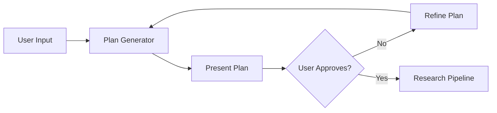
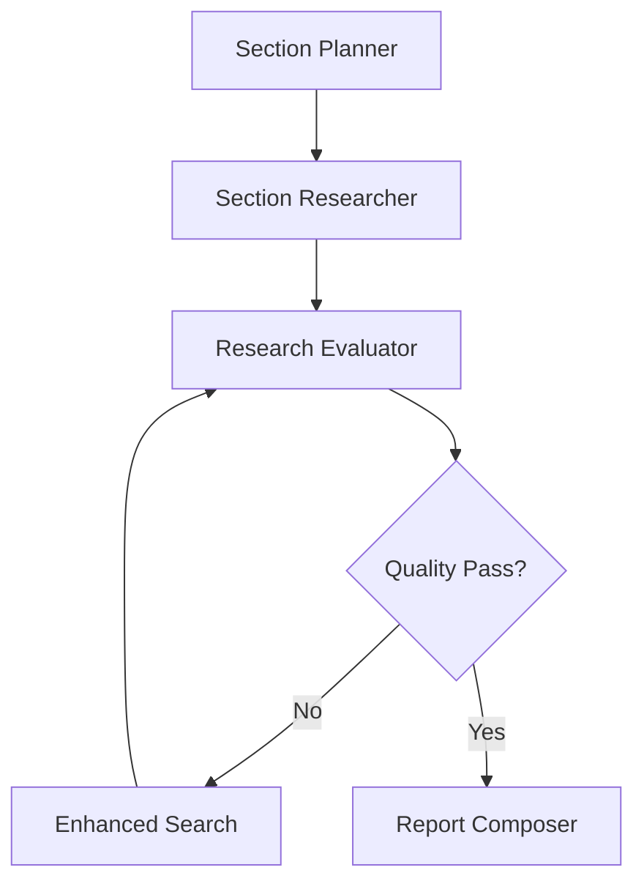

# Gemini Fullstack Agent: Comprehensive Implementation Documentation

## Table of Contents
1. [Architecture Overview](#architecture-overview)
2. [Backend Implementation](#backend-implementation)
3. [Frontend Implementation](#frontend-implementation)
4. [API Layer](#api-layer)
5. [Agent Workflow Details](#agent-workflow-details)
6. [Key Implementation Patterns](#key-implementation-patterns)
7. [Deployment Options](#deployment-options)
8. [Design Decisions & Best Practices](#design-decisions--best-practices)

## Architecture Overview

### System Components

The Gemini Fullstack Agent is a production-ready multi-agent research system with three main layers:

```
┌──────────────────────────────────────────────────┐
│               Frontend (React + Vite)            │
│  - Real-time UI with SSE streaming               │
│  - Activity timeline visualization               │
│  - Markdown rendering with citations             │
└────────────────────────┬─────────────────────────┘
                         │ HTTP/SSE
┌────────────────────────┴─────────────────────────┐
│          API Layer (ADK API Server)              │
│  - FastAPI-based server                          │
│  - Session management                            │
│  - SSE streaming endpoints                       │
└────────────────────────┬─────────────────────────┘
                         │
┌────────────────────────┴─────────────────────────┐
│         Backend (Google ADK Agents)              │
│  - Multi-agent orchestration                     │
│  - Google Search integration                     │
│  - State management & callbacks                  │
└──────────────────────────────────────────────────┘
```

### Technology Stack

**Backend:**
- Google ADK 1.8.0+ - Core agent framework
- Python 3.10-3.12 - Runtime environment
- Gemini Models - LLM backbone (2.5-pro for critic, 2.5-flash for workers)
- Google Search API - Grounding and information retrieval

**Frontend:**
- React 19 - UI framework
- Vite - Build tool and dev server
- Tailwind CSS - Styling
- Shadcn/ui - Component library
- React Markdown - Content rendering

**Package Management:**
- uv - Python package manager
- npm - Node.js package manager

## Backend Implementation

### Agent Hierarchy

The system implements a hierarchical multi-agent architecture with specialized roles:

```python
root_agent (interactive_planner_agent)
├── plan_generator (LlmAgent)
└── research_pipeline (SequentialAgent)
    ├── section_planner (LlmAgent)
    ├── section_researcher (LlmAgent)
    ├── iterative_refinement_loop (LoopAgent)
    │   ├── research_evaluator (LlmAgent)
    │   ├── escalation_checker (Custom BaseAgent)
    │   └── enhanced_search_executor (LlmAgent)
    └── report_composer (LlmAgent)
```

### Agent Definitions

#### 1. Interactive Planner Agent (Root)
```python
interactive_planner_agent = LlmAgent(
    name="interactive_planner_agent",
    model=config.worker_model,
    description="The primary research assistant",
    instruction=f"""...""",
    sub_agents=[research_pipeline],
    tools=[AgentTool(plan_generator)],
    output_key="research_plan",
)
```
- Entry point for all user interactions
- Manages human-in-the-loop planning phase
- Delegates execution to research_pipeline upon approval

#### 2. Plan Generator
```python
plan_generator = LlmAgent(
    model=config.worker_model,
    name="plan_generator",
    instruction=f"""...""",
    tools=[google_search],
)
```
- Creates 5-line action-oriented research plans
- Classifies tasks as [RESEARCH] or [DELIVERABLE]
- Uses minimal search only for topic clarification
- Supports plan refinement with [MODIFIED], [NEW], [IMPLIED] tags

#### 3. Research Pipeline
```python
research_pipeline = SequentialAgent(
    name="research_pipeline",
    description="Executes a pre-approved research plan",
    sub_agents=[
        section_planner,
        section_researcher,
        iterative_refinement_loop,
        report_composer,
    ],
)
```
- Orchestrates the entire research workflow
- Executes agents sequentially
- Maintains state across all sub-agents

#### 4. Section Researcher
```python
section_researcher = LlmAgent(
    model=config.worker_model,
    name="section_researcher",
    planner=BuiltInPlanner(
        thinking_config=genai_types.ThinkingConfig(include_thoughts=True)
    ),
    tools=[google_search],
    output_key="section_research_findings",
    after_agent_callback=collect_research_sources_callback,
)
```
- Performs two-phase execution:
  - Phase 1: Information gathering for [RESEARCH] tasks
  - Phase 2: Synthesis and output creation for [DELIVERABLE] tasks
- Uses thinking mode for better reasoning
- Collects sources via callback

#### 5. Iterative Refinement Loop
```python
LoopAgent(
    name="iterative_refinement_loop",
    max_iterations=config.max_search_iterations,
    sub_agents=[
        research_evaluator,
        EscalationChecker(name="escalation_checker"),
        enhanced_search_executor,
    ],
)
```
- Implements quality control loop
- Evaluates research and generates follow-up queries
- Continues until quality threshold met or max iterations reached

### State Management

The system uses ADK's session state for data persistence:

```python
# Key state variables
context.state["research_plan"]              # Approved research plan
context.state["report_sections"]            # Markdown outline
context.state["section_research_findings"]  # Research data
context.state["research_evaluation"]        # Quality assessment
context.state["url_to_short_id"]           # URL mapping
context.state["sources"]                    # Source metadata
context.state["final_cited_report"]        # Raw report with tags
context.state["final_report_with_citations"] # Processed report
```

### Callback System

#### 1. Source Collection Callback
```python
def collect_research_sources_callback(callback_context: CallbackContext) -> None:
    """Collects and organizes web-based research sources"""
    # Extracts grounding_chunks from events
    # Maps URLs to short IDs (src-1, src-2, etc.)
    # Stores supported claims with confidence scores
```

#### 2. Citation Replacement Callback
```python
def citation_replacement_callback(callback_context: CallbackContext) -> genai_types.Content:
    """Replaces citation tags with Markdown links"""
    # Converts <cite source="src-N"/> to [Title](URL)
    # Fixes spacing around punctuation
    # Returns processed report
```

### Custom Agent: EscalationChecker

```python
class EscalationChecker(BaseAgent):
    async def _run_async_impl(self, ctx: InvocationContext):
        evaluation_result = ctx.session.state.get("research_evaluation")
        if evaluation_result and evaluation_result.get("grade") == "pass":
            yield Event(author=self.name, actions=EventActions(escalate=True))
```
- Implements loop control logic
- Checks research quality assessment
- Escalates to stop loop when quality threshold met

## Frontend Implementation

### Component Architecture

```
App.tsx (Main Application)
├── WelcomeScreen (Initial UI)
│   └── InputForm
├── ChatMessagesView (Conversation UI)
│   ├── ActivityTimeline
│   ├── InputForm
│   └── Markdown Renderer
└── UI Components (Shadcn)
    ├── Button
    ├── Badge
    ├── ScrollArea
    └── Tabs
```

### Key React Components

#### 1. App.tsx - Main Application
```typescript
export default function App() {
  const [messages, setMessages] = useState<MessageWithAgent[]>([]);
  const [messageEvents, setMessageEvents] = useState<Map<string, ProcessedEvent[]>>(new Map());
  const [websiteCount, setWebsiteCount] = useState<number>(0);
  
  // SSE handling, session management, backend health checks
}
```

#### 2. SSE Stream Processing
```typescript
const processSseEventData = (jsonData: string, aiMessageId: string) => {
  const { textParts, agent, finalReportWithCitations, 
          functionCall, sourceCount } = extractDataFromSSE(jsonData);
  
  // Update website count for research agents
  if (sourceCount > 0) {
    setWebsiteCount(prev => Math.max(prev, sourceCount));
  }
  
  // Handle different agent outputs
  if (agent === "interactive_planner_agent") {
    // Update main AI message
  } else if (agent === "report_composer_with_citations") {
    // Add final report as new message
  } else {
    // Add to activity timeline
  }
};
```

#### 3. Activity Timeline
```typescript
interface ProcessedEvent {
  title: string;
  data: {
    type: 'text' | 'functionCall' | 'functionResponse' | 'sources';
    content?: string;
    name?: string;
  };
}
```
- Visualizes agent execution flow
- Shows function calls and responses
- Tracks website consultation count

### State Management

The frontend maintains several state variables:

```typescript
// Session state
const [userId, setUserId] = useState<string | null>(null);
const [sessionId, setSessionId] = useState<string | null>(null);
const [appName, setAppName] = useState<string | null>(null);

// Message state
const [messages, setMessages] = useState<MessageWithAgent[]>([]);
const [displayData, setDisplayData] = useState<DisplayData | null>(null);

// Activity tracking
const [messageEvents, setMessageEvents] = useState<Map<string, ProcessedEvent[]>>(new Map());
const [websiteCount, setWebsiteCount] = useState<number>(0);

// UI state
const [isLoading, setIsLoading] = useState(false);
const [isBackendReady, setIsBackendReady] = useState(false);
```

### Real-time Updates

The system uses Server-Sent Events (SSE) for real-time updates:

```typescript
// SSE parsing
while ((eolIndex = lineBuffer.indexOf('\n')) >= 0 || (done && lineBuffer.length > 0)) {
  if (line.startsWith('data:')) {
    eventDataBuffer += line.substring(5).trimStart() + '\n';
  } else if (line.trim() === "") {
    processSseEventData(eventDataBuffer, aiMessageId);
    eventDataBuffer = "";
  }
}
```

## API Layer

### ADK API Server

The system uses ADK's built-in API server:

```bash
# Start command from Makefile
uv run adk api_server app --allow_origins="*"
```

### Key Endpoints

#### 1. Session Creation
```
POST /api/apps/{app_name}/users/{user_id}/sessions/{session_id}
```
- Creates new conversation session
- Initializes state storage

#### 2. SSE Streaming
```
POST /api/run_sse
Body: {
  appName: string,
  userId: string,
  sessionId: string,
  newMessage: {
    parts: [{text: string}],
    role: "user"
  },
  streaming: boolean
}
```
- Streams agent responses in real-time
- Returns events with agent metadata

#### 3. Health Check
```
GET /api/docs
```
- Used to verify backend readiness
- Frontend implements retry logic

## Agent Workflow Details

### Phase 1: Human-in-the-Loop Planning



1. **Initial Planning:**
   - User provides research topic
   - Plan generator creates 5 action-oriented goals
   - Tasks classified as [RESEARCH] or [DELIVERABLE]

2. **Plan Refinement:**
   - User can modify, add, or remove goals
   - System tracks changes with tags:
     - [MODIFIED] - Updated existing goal
     - [NEW] - User-added goal
     - [IMPLIED] - System-suggested deliverable

### Phase 2: Autonomous Research Execution



1. **Outlining:**
   - Converts plan to structured markdown outline
   - Creates 4-6 distinct sections

2. **Research Loop:**
   - **Search:** 4-5 targeted queries per research goal
   - **Evaluate:** Critical assessment of findings
   - **Refine:** Generate follow-up queries if needed
   - **Iterate:** Up to 5 iterations (configurable)

3. **Report Composition:**
   - Synthesizes all research findings
   - Adds inline citations using `<cite source="src-N"/>` tags
   - Callbacks convert tags to markdown links

## Key Implementation Patterns

### 1. Structured Output Models

```python
class SearchQuery(BaseModel):
    search_query: str = Field(description="Targeted query for web search")

class Feedback(BaseModel):
    grade: Literal["pass", "fail"]
    comment: str
    follow_up_queries: list[SearchQuery] | None
```
- Enforces response structure
- Enables type-safe agent communication

### 2. Loop Control Pattern

```python
# Custom agent for loop control
class EscalationChecker(BaseAgent):
    async def _run_async_impl(self, ctx):
        if quality_check_passed:
            yield Event(actions=EventActions(escalate=True))
```
- Implements dynamic loop termination
- Prevents unnecessary iterations

### 3. Source Tracking

```python
# URL to short ID mapping
url_to_short_id = {
    "https://example.com/article": "src-1",
    "https://news.site/story": "src-2"
}

# Source metadata
sources = {
    "src-1": {
        "short_id": "src-1",
        "title": "Article Title",
        "url": "https://example.com/article",
        "domain": "example.com",
        "supported_claims": [...]
    }
}
```

### 4. Error Handling

Frontend implements comprehensive retry logic:

```typescript
const retryWithBackoff = async (
  fn: () => Promise<any>,
  maxRetries: number = 10,
  maxDuration: number = 120000
): Promise<any> => {
  // Exponential backoff with max delay
  const delay = Math.min(1000 * Math.pow(2, attempt), 5000);
};
```

## Deployment Options

### 1. Local Development

```bash
# Install dependencies
make install

# Start development servers
make dev
# Runs both:
# - Backend: uv run adk api_server app --allow_origins="*"
# - Frontend: npm --prefix frontend run dev
```

### 2. Google Cloud Run

```bash
# Set project
gcloud config set project YOUR_PROJECT_ID

# Deploy backend
make backend
```

Features:
- Containerized deployment
- Auto-scaling
- HTTPS by default

### 3. Vertex AI Agent Engine

```python
# In pyproject.toml
[tool.agent-starter-pack.settings]
deployment_targets = ["agent_engine", "cloud_run"]
```

Benefits:
- Managed agent runtime
- Built-in monitoring
- Enterprise features

## Design Decisions & Best Practices

### 1. Model Selection Strategy

```python
@dataclass
class ResearchConfiguration:
    critic_model: str = "gemini-2.5-pro"    # Higher quality for evaluation
    worker_model: str = "gemini-2.5-flash"  # Faster for generation
    max_search_iterations: int = 5
```
- Pro model for critical evaluation tasks
- Flash model for high-volume generation
- Configurable iteration limits

### 2. Performance Optimizations

#### Backend:
- Thinking mode for complex reasoning
- Parallel search query execution
- State caching between agents

#### Frontend:
- SSE streaming for real-time updates
- Lazy loading of components
- Efficient re-rendering with React 19

### 3. Security Considerations

#### API Security:
```python
# CORS configuration
--allow_origins="*"  # Development only
```

#### Environment Variables:
```bash
# Secure credential storage
GOOGLE_API_KEY=...
GOOGLE_CLOUD_PROJECT=...
```

### 4. User Experience

#### Progressive Disclosure:
1. Welcome screen with examples
2. Interactive planning phase
3. Real-time activity timeline
4. Final report with citations

#### Error Handling:
- Backend health checks with retry
- Graceful degradation
- User-friendly error messages

### 5. Extensibility

The architecture supports:
- Custom agent additions
- New tool integrations
- Alternative LLM models
- Custom UI components

#### Adding a New Agent:
```python
custom_agent = LlmAgent(
    name="custom_analyzer",
    model=config.worker_model,
    instruction="...",
    tools=[custom_tool],
    output_key="analysis_results"
)

# Add to pipeline
research_pipeline.sub_agents.append(custom_agent)
```

#### Frontend Customization:
```typescript
// Add new agent to timeline mapping
const getEventTitle = (agentName: string): string => {
  switch (agentName) {
    case "custom_analyzer":
      return "Analyzing Data";
    // ...
  }
};
```

## Summary

The Gemini Fullstack Agent demonstrates a sophisticated implementation of:
- Multi-agent orchestration with Google ADK
- Human-in-the-loop workflows
- Real-time streaming interfaces
- Production-ready deployment patterns

Key strengths:
- Modular, extensible architecture
- Clear separation of concerns
- Comprehensive error handling
- Excellent user experience

This implementation serves as an exemplary template for building production-ready AI agent applications that combine the power of LLMs with structured workflows and intuitive user interfaces.